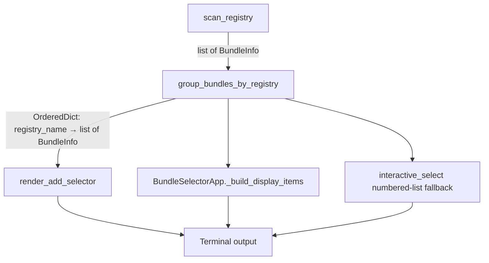

# Design Document: Bundle Registry Grouping

## Overview

This feature replaces the flat alphabetical bundle listing with registry-grouped output across all bundle listing UIs in the `ksm` CLI. Bundles will be grouped under their source registry name, with both groups and bundles within groups sorted case-insensitively. A single reusable grouping function drives all rendering paths for consistency.

Currently, `render_add_selector`, `BundleSelectorApp`, `interactive_select`, and the numbered-list fallback all sort bundles into a single flat list by `(name.lower(), registry_name.lower())`. This design introduces a grouping layer between the raw bundle list and the rendering logic.

## Architecture

The change is localised to the presentation layer. No changes to data models, registry loading, scanning, resolution, or installation logic are needed.

### Design Decisions

1. **Single grouping function** — All rendering paths call the same `group_bundles_by_registry()` function. This avoids divergent sorting/grouping logic across `selector.py` and `tui.py`.

2. **Refactor over new module** — The grouping function lives in `selector.py` alongside the existing rendering functions rather than a new module, since it is tightly coupled to the selector rendering and keeps the change surface small.

3. **Empty registry name sorts last** — Bundles with an empty `registry_name` are placed in a group keyed by `""`, sorted after all named groups. This handles edge cases like ephemeral or default registries that may not have a name.

4. **Non-selectable separator rows in TUI** — In `BundleSelectorApp`, registry group headers are rendered as disabled `Option` items in the `OptionList`. Users cannot highlight or select them. The `multi_selected` index tracking skips separator rows.

5. **Continuous numbering in fallback** — The numbered-list fallback uses a single continuous numbering sequence across all groups, so each bundle has a unique selectable number regardless of which group it belongs to.

## Components and Interfaces

### `group_bundles_by_registry(bundles: list[BundleInfo]) -> dict[str, list[BundleInfo]]`

New function in `src/ksm/selector.py`.

**Input:** Flat list of `BundleInfo` objects.

**Output:** `dict[str, list[BundleInfo]]` (insertion-ordered) where:
- Keys are `registry_name` values, sorted case-insensitively.
- Empty-string key sorts last.
- Values are lists of `BundleInfo` sorted case-insensitively by `name`.

**Usage:** Called by `render_add_selector`, `BundleSelectorApp._build_display_items`, `interactive_select` (fallback path).

### Changes to `render_add_selector`

- Replace the current flat `sorted()` call with `group_bundles_by_registry()`.
- Insert a header line (dimmed registry name) before each group's bundles.
- When `filter_text` is provided, filter bundles first, then group. Groups with zero matches are omitted.
- The `selected` index and `multi_selected` set continue to reference positions in the flattened bundle list (excluding header lines).

### Changes to `BundleSelectorApp._build_display_items` (tui.py)

- Replace the current flat sort with `group_bundles_by_registry()`.
- Insert non-selectable `Option` separator rows for each registry group header.
- Track a mapping from display-row index to bundle index so that selection, multi-select, and filtering work correctly.
- When filtering, re-group the filtered results and hide empty groups.

### Changes to `interactive_select` (numbered-list fallback)

- Use `group_bundles_by_registry()` to organise bundles.
- Print a text header for each registry group.
- Use continuous 1-based numbering across all groups.

### Changes to `_numbered_list_select`

- Accept grouped items or adapt the caller to flatten after grouping.
- Print group headers between numbered items.

## Data Models

No new data models are introduced. The existing `BundleInfo` dataclass already carries `registry_name`, which is the grouping key.

The grouping function returns a standard `dict[str, list[BundleInfo]]` (Python 3.7+ insertion-ordered dict). No new dataclass or named tuple is needed.

## Correctness Properties

*A property is a characteristic or behavior that should hold true across all valid executions of a system — essentially, a formal statement about what the system should do. Properties serve as the bridge between human-readable specifications and machine-verifiable correctness guarantees.*

### Property 1: Grouping function produces sorted groups with sorted bundles

*For any* list of `BundleInfo` objects with non-empty `registry_name` values, `group_bundles_by_registry()` shall return a dict whose keys are in case-insensitive alphabetical order, and whose values are lists of `BundleInfo` sorted in case-insensitive alphabetical order by `name`.

**Validates: Requirements 1.2, 1.3, 6.1, 6.2, 6.3**

### Property 2: Empty registry name sorts last

*For any* list of `BundleInfo` objects where at least one has an empty `registry_name` and at least one has a non-empty `registry_name`, `group_bundles_by_registry()` shall place the empty-string key last in the returned dict.

**Validates: Requirements 6.4**

### Property 3: Rendered output contains a group header for each registry

*For any* list of `BundleInfo` objects spanning multiple registries, `render_add_selector()` shall produce output lines that contain a header line for each distinct `registry_name` before that group's bundle lines.

**Validates: Requirements 1.1, 4.1**

### Property 4: Filtering hides empty groups

*For any* list of `BundleInfo` objects and any `filter_text`, `render_add_selector()` shall not produce a group header for any `registry_name` whose bundles all fail to match the filter. Every group header that does appear shall have at least one matching bundle line following it.

**Validates: Requirements 2.4, 4.4**

### Property 5: Continuous numbering across groups in fallback

*For any* list of `BundleInfo` objects spanning multiple registries, the numbered-list fallback shall assign continuous 1-based numbers to bundles across all groups with no gaps or duplicates, and the total count of numbered items shall equal the number of bundles.

**Validates: Requirements 3.4**

### Property 6: Selection from grouped list returns correct qualified name

*For any* `BundleInfo` with a non-empty `registry_name`, selecting that bundle from the grouped list shall return `"{registry_name}/{name}"`. For any `BundleInfo` with an empty `registry_name`, selecting it shall return the bare `name` with no leading `/`.

**Validates: Requirements 5.1**

## Error Handling

This feature introduces no new error conditions. The grouping function handles edge cases gracefully:

- **Empty bundle list** — Returns an empty dict. Renderers already handle empty lists.
- **All bundles from one registry** — Returns a single-entry dict. The single group header is displayed (Req 1.4).
- **Empty registry name** — Grouped under `""` key, sorted last. No crash or missing output.
- **Filter matches nothing** — No group headers rendered. Existing "no matches" message displayed.

## Testing Strategy

### Property-Based Testing

Use **Hypothesis** (already a dev dependency) for property-based tests. Each property test references its design document property via a comment tag.

Tag format: `Feature: bundle-registry-grouping, Property {N}: {title}`

Configuration uses the existing two-tier Hypothesis profiles in `conftest.py` (dev: 15 examples, ci: 100 examples).

Each correctness property above maps to a single `@given`-decorated test function.

### Unit Testing

Unit tests cover specific examples and edge cases not suited to property testing:

- Single registry displays group header (Req 1.4)
- Numbered-list fallback renders group headers as text (Req 3.1)
- No-match filter shows "no matches" message (Req 5.4)
- TUI separator rows are non-selectable (Req 2.2)
- Multi-select across groups tracks correct indices (Req 5.2)

### Test Organisation

All new tests go in `tests/test_selector.py` (for `group_bundles_by_registry` and `render_add_selector` changes) and `tests/test_tui.py` (for `BundleSelectorApp` changes), following the existing test file structure.

### PBT Library

- Library: `hypothesis` (already in `pyproject.toml` dev dependencies)
- Minimum iterations: 100 (CI profile), 15 (dev profile)
- Each property test is a single `@given`-decorated function
- No custom PBT framework — use Hypothesis directly
