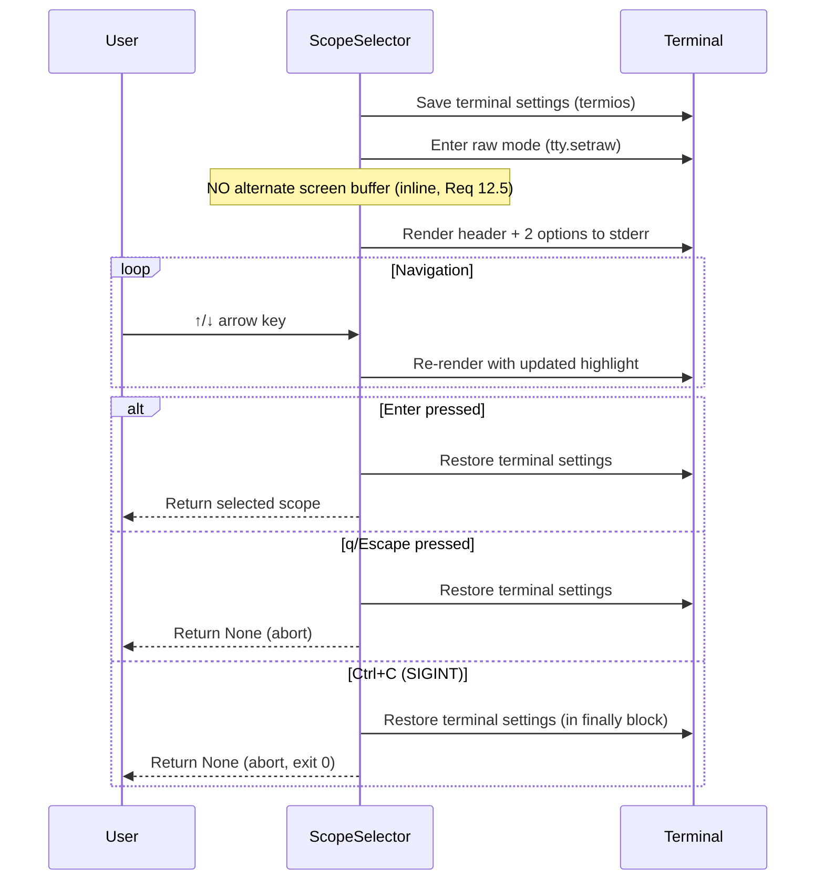
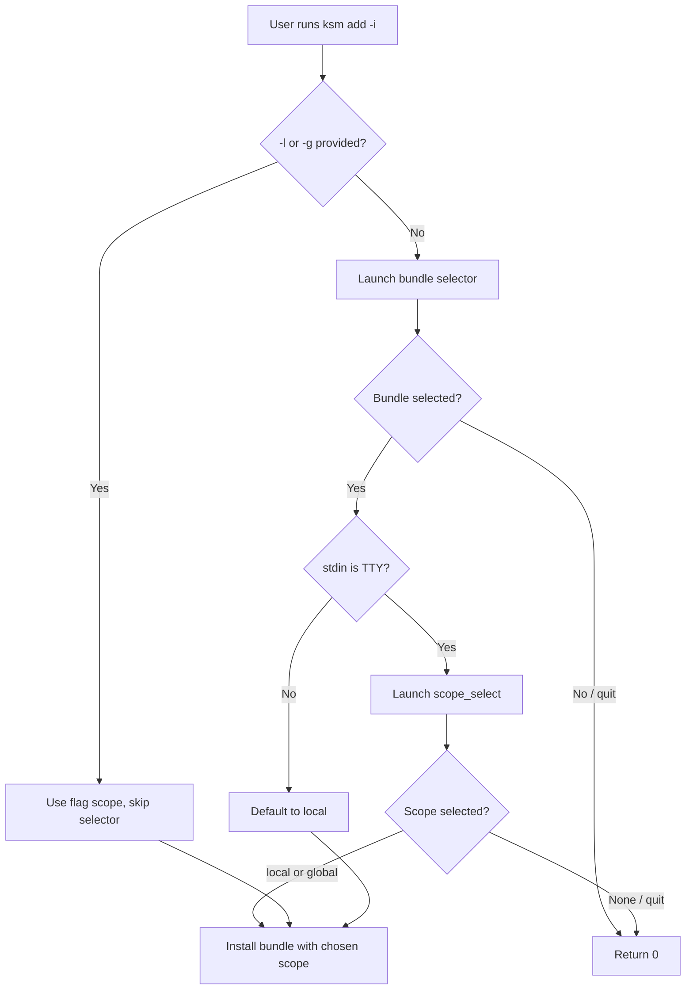

# Design: Color Scheme & Scope Selection

## Context

The ksm CLI has a fully-implemented color module (`color.py`) with `green()`, `red()`, `yellow()`, `dim()`, and `bold()` — but only `bold` and `dim` are wired in. Error, warning, and success output is plain text. The interactive `ksm add -i` flow also lacks a scope selection step: users must know about `-l`/`-g` flags to choose global scope.

This design activates the unused color functions across all CLI output and adds an inline scope selector to the interactive add flow.

## Goals

1. Every message type is visually distinguishable at a glance (Reqs 1–10)
2. Color is never the sole indicator — symbols and text labels always accompany it (Reqs 1.4, 3.5, 4.1–4.3, 5.1–5.3)
3. `NO_COLOR`, `TERM=dumb`, and non-TTY environments produce clean plain text (Reqs 1.2, 1.3, 1.5, 2.3, 3.4, 4.5, 5.4, 6.5, 7.3, 8.5, 9.3, 10.3, 16.4, 16.5)
4. Interactive add flow is self-contained — no flags needed (Reqs 11–16)

## 1. Architecture Overview

```
┌─────────────────────────────────────────────────────────┐
│                    Color Module (color.py)               │
│  green() red() yellow() dim() bold()                     │
│  All accept optional stream: TextIO for TTY detection    │
│  Gated by: NO_COLOR, TERM=dumb, stream.isatty()         │
└──────────────────────┬──────────────────────────────────┘
                       │ imported by
       ┌───────────────┼───────────────────┐
       ▼               ▼                   ▼
  errors.py        copier.py          selector.py
  (format_error,   (format_diff_      (render_add_selector,
   format_warning,  summary)           render_removal_selector,
   format_deprec.)                     NEW: scope_select)
       │               │                   │
       ▼               ▼                   ▼
  All command modules: add.py, rm.py, sync.py,
  ls.py, info.py, search.py, registry_ls.py,
  registry_inspect.py
```

Changes fall into two categories:

**A. Color wiring (Reqs 1–10):** Modify `errors.py`, `copier.py`, `selector.py`, and command modules to import and apply `green`, `red`, `yellow` where they are currently absent. The `stream` parameter threads through formatters so TTY detection targets the correct output stream.

**B. Scope selection (Reqs 11–16):** Add a `scope_select()` function to `selector.py` that reuses the existing raw-mode / numbered-list-fallback pattern. Integrate it into `commands/add.py` after bundle selection.

## 2. Color Semantic Mapping

| Color      | Semantic Role          | Used For                                                        | Text Companion        |
|------------|------------------------|-----------------------------------------------------------------|-----------------------|
| `red()`    | Error                  | `Error:` prefix in `format_error`                               | "Error:" label        |
| `yellow()` | Warning / Deprecation  | `Warning:` prefix, `Deprecated:` prefix, `~` diff, `(updated)` | Label text always     |
| `green()`  | Success / New          | `Installed:`, `Removed`, `Synced:`, `+` diff, `(new)`, installed status | Label text always |
| `bold()`   | Emphasis / Primary     | Bundle names, headers, scope descriptions, highlighted selector item | Structural position |
| `dim()`    | Secondary / De-emphasis| Timestamps, registry names, paths, instructions, `=` diff, `(unchanged)`, `[installed]` badge | Always has text |

## 3. Module-by-Module Changes

### 3.1 `color.py` — No Changes

The module is complete. All five functions (`green`, `red`, `yellow`, `dim`, `bold`) exist with correct `stream` parameter and `NO_COLOR`/`TERM=dumb`/non-TTY gating. No modifications needed.

### 3.2 `errors.py` — Add `stream` Parameter to Formatters (Reqs 1, 2)

**Problem:** `format_error`, `format_warning`, and `format_deprecation` are pure string formatters with no access to the target stream. Color functions need `stream` to detect TTY correctly (errors go to stderr).

**Design:** Add an optional `stream: TextIO | None = None` parameter to each formatter. Apply color to the prefix only. Default `None` preserves backward compatibility (color functions default to stdout check, which is wrong for stderr — callers should pass `stream=sys.stderr`).

```python
def format_error(what: str, why: str, fix: str, stream: TextIO | None = None) -> str:
    prefix = red("Error:", stream=stream)
    return f"{prefix} {what}\n  {why}\n  {fix}"

def format_warning(what: str, detail: str, stream: TextIO | None = None) -> str:
    prefix = yellow("Warning:", stream=stream)
    return f"{prefix} {what}\n  {detail}"

def format_deprecation(old: str, new: str, since: str, removal: str, stream: TextIO | None = None) -> str:
    prefix = yellow("Deprecated:", stream=stream)
    return (
        f"{prefix} `{old}` is deprecated,"
        f" use `{new}` instead.\n"
        f"  Deprecated in {since},"
        f" will be removed in {removal}."
    )
```

**Call-site update:** Every call site already passes `file=sys.stderr` to `print()`. Add `stream=sys.stderr` to the formatter call. Example from `add.py`:

```python
# Before
print(format_error("No bundle specified.", ..., ...), file=sys.stderr)

# After
print(format_error("No bundle specified.", ..., ..., stream=sys.stderr), file=sys.stderr)
```

This is a mechanical change across all command modules. The `stream` parameter is keyword-only after the existing positional args, so no existing call breaks if `stream` is omitted.

### 3.3 `copier.py` — Colorize Diff Summary (Req 4)

**Problem:** `format_diff_summary` outputs `+`, `~`, `=` symbols with `(new)`, `(updated)`, `(unchanged)` labels but no color.

**Design:** Add `stream: TextIO | None = None` parameter. Apply color per status:

```python
from ksm.color import green, yellow, dim

_STATUS_COLORS: dict[CopyStatus, Callable] = {
    CopyStatus.NEW: green,       # + (new)
    CopyStatus.UPDATED: yellow,  # ~ (updated)
    CopyStatus.UNCHANGED: dim,   # = (unchanged)
}

def format_diff_summary(results: list[CopyResult], stream: TextIO | None = None) -> str:
    lines: list[str] = []
    for r in results:
        sym = _STATUS_SYMBOLS[r.status]
        color_fn = _STATUS_COLORS[r.status]
        colored_sym = color_fn(sym, stream=stream)
        colored_label = color_fn(f"({r.status.value})", stream=stream)
        lines.append(f"  {colored_sym} {r.path} {colored_label}")
    return "\n".join(lines)
```

**Call-site update:** All callers (`add.py`, `sync.py`, ephemeral flow) pass `stream=sys.stderr`:

```python
print(format_diff_summary(results, stream=sys.stderr), file=sys.stderr)
```

### 3.4 `selector.py` — Color Existing Selectors + New Scope Selector (Reqs 6, 11–13, 16)

#### 3.4.1 Color Existing Render Functions (Req 6)

Apply color to `render_add_selector` and `render_removal_selector`:

| Element | Color | Req |
|---------|-------|-----|
| Header (`_ADD_HEADER`, `_RM_HEADER`) | `bold(_, stream=sys.stderr)` | 6.3 |
| Instructions (`_ADD_INSTRUCTIONS`, `_RM_INSTRUCTIONS`) | `dim(_, stream=sys.stderr)` | 6.4 |
| Highlighted bundle name (line with `>` prefix) | `bold(padded, stream=sys.stderr)` | 6.1 |
| `[installed]` badge | `dim("[installed]", stream=sys.stderr)` | 6.2 |
| `[scope]` label in removal selector | `dim(f"[{entry.scope}]", stream=sys.stderr)` | 6.6 |
| Filter prompt | `dim(f"Filter: {filter_text}", stream=sys.stderr)` | 6.7 |

The render functions already build string lines. Color wrapping is applied inline during line construction. Since these always render to stderr, `stream=sys.stderr` is hardcoded.

#### 3.4.2 New `scope_select()` Function (Reqs 11–13, 16)

```python
_SCOPE_OPTIONS = [
    ("local", "Local (.kiro/)"),
    ("global", "Global (~/.kiro/)"),
]
_SCOPE_HEADER = "Select installation scope:"
_SCOPE_INSTRUCTIONS = "↑/↓ navigate, Enter select, q quit"


def scope_select() -> str | None:
    """Interactive scope selection. Returns "local", "global", or None (abort).

    - Raw mode: inline arrow-key navigation (no alternate screen buffer)
    - Fallback: numbered list prompt
    - Non-TTY stdin: returns None (caller defaults to "local")
    """
```

**Raw mode flow (Req 12):**



**Key differences from bundle selector:**
- **No alternate screen buffer** — only 2 options, renders inline (Req 12.5)
- **No filter text** — only 2 items, filtering is pointless
- **No multi-select** — single choice only
- **Cursor cleanup:** Write `\r` + clear-to-end-of-line for each option line, then move cursor up to re-render. On exit, leave the rendered output visible.

**Rendering (raw mode):**

```
Select installation scope:
↑/↓ navigate, Enter select, q quit

> Local (.kiro/)
  Global (~/.kiro/)
```

With color applied:
- Header: `bold("Select installation scope:", stream=sys.stderr)`
- Instructions: `dim("↑/↓ navigate, Enter select, q quit", stream=sys.stderr)`
- Highlighted option: `bold("> Local (.kiro/)", stream=sys.stderr)`
- Non-highlighted: plain `"  Global (~/.kiro/)"`

**Numbered-list fallback (Req 13):**

```
Select installation scope:

  1. Local (.kiro/)
  2. Global (~/.kiro/)

Enter number [1-2] or q:
```

Reuse `_numbered_list_select` with items `[("Local (.kiro/)", ""), ("Global (~/.kiro/)", "")]`. Map index 0 → `"local"`, index 1 → `"global"`, None → None.

**SIGINT handling (Req 12.6):**

The `try/finally` block in the raw-mode path already restores terminal settings via `termios.tcsetattr`. Wrap the raw-mode loop in an additional `except KeyboardInterrupt` that returns `None`:

```python
try:
    tty.setraw(fd)
    # render loop...
except KeyboardInterrupt:
    return None
finally:
    termios.tcsetattr(fd, termios.TCSADRAIN, old_settings)
    sys.stderr.write("\n")
    sys.stderr.flush()
```

**Non-TTY stdin (Req 11.7):** `_use_raw_mode()` returns `False`. The numbered-list fallback checks `sys.stdin.isatty()` — if False, return `None`. The caller in `add.py` defaults to `"local"`.

### 3.5 `commands/add.py` — Wire Scope Selection + Color (Reqs 3.1, 11, 15)

#### Scope Selection Integration (Reqs 11, 15)

Modify `_handle_display` and the interactive path in `run_add`:



**Changes to `_handle_display`:** Currently returns `str | None` (bundle name). Change return type to `tuple[str, str] | None` — `(bundle_name, scope)`. After bundle selection, call `scope_select()`. If scope is `None`, return `None` (abort).

Alternatively, keep `_handle_display` unchanged and call `scope_select()` in `run_add` after getting the bundle name. This is cleaner — scope selection is a command concern, not a display concern.

**Chosen approach:** Call `scope_select()` in `run_add` after `_handle_display` returns a bundle name, but only when `-l`/`-g` was not provided:

```python
if interactive:
    bundle_name = _handle_display(registry_index, manifest)
    if bundle_name is None:
        return 0
    bundle_spec = bundle_name

    # Scope selection (Req 11)
    if not getattr(args, "global_", False) and not getattr(args, "local_", False):
        if sys.stdin.isatty():
            from ksm.selector import scope_select
            chosen_scope = scope_select()
            if chosen_scope is None:
                return 0
            scope = chosen_scope
        else:
            scope = "local"  # Req 11.7
```

Note: The existing code determines scope later with `scope = "global" if getattr(args, "global_", False) else "local"`. The interactive scope selection must override this. Move scope determination earlier for the interactive path, or set a flag that the later scope assignment respects.

#### Success Message Color (Req 3.1)

After `install_bundle` succeeds, print a green prefix:

```python
from ksm.color import green

if results:
    prefix = green("Installed:", stream=sys.stderr)
    print(f"{prefix} '{bundle_spec}'", file=sys.stderr)
    print(format_diff_summary(results, stream=sys.stderr), file=sys.stderr)
```

### 3.6 `commands/rm.py` — Color Success + Confirmation (Reqs 3.2, 7)

#### Success Message (Req 3.2)

In `_format_result`, wrap the "Removed" prefix in green. Add `stream` parameter:

```python
def _format_result(bundle_name: str, scope: str, result: RemovalResult, stream: TextIO | None = None) -> str:
    removed = len(result.removed_files)
    skipped = len(result.skipped_files)
    prefix = green("Removed", stream=stream)
    # ... rest unchanged, using prefix instead of "Removed"
```

Call sites pass `stream=sys.stderr`.

#### Confirmation Prompt Color (Req 7)

In `_format_confirmation`, wrap file paths in `dim()` and scope description in `bold()`:

```python
def _format_confirmation(entry: ManifestEntry, stream: TextIO | None = None) -> str:
    scope_desc = bold(".kiro/", stream=stream) if entry.scope == "local" else bold("~/.kiro/", stream=stream)
    # ...
    for f in entry.installed_files:
        lines.append(f"    {dim(f, stream=stream)}")
```

### 3.7 `commands/sync.py` — Color Success + Confirmation (Reqs 3.3, 10)

#### Success Message (Req 3.3)

After each `_sync_entry` prints the diff summary, add a green prefix:

```python
if results:
    prefix = green("Synced:", stream=sys.stderr)
    print(f"{prefix} '{entry.bundle_name}'", file=sys.stderr)
    print(format_diff_summary(results, stream=sys.stderr), file=sys.stderr)
```

#### Confirmation Prompt Color (Req 10)

In `_build_confirmation_message`, wrap bundle names in `bold()` and scope description in `bold()`:

```python
def _build_confirmation_message(entries: list[ManifestEntry], stream: TextIO | None = None) -> str:
    bundle_names_str = ", ".join(bold(e.bundle_name, stream=stream) for e in entries)
    # ...
    scope_desc = bold(scope_desc, stream=stream)
```

### 3.8 `commands/ls.py` — Verify Only (Req 5)

**Status:** Already correct. `bold()` wraps bundle names and scope headers. `dim()` wraps registry names and timestamps. No changes needed.

**Verify:** Confirm `bold()` and `dim()` calls exist in `_format_grouped`. ✓ Confirmed in source.

### 3.9 `commands/info.py` — Extend Installed Status Color (Req 9.2)

Currently, installed status shows plain text `"Installed: local, global"` or `dim("no")`. Change to green when installed:

```python
from ksm.color import bold, dim, green

if installed_scopes:
    scopes_str = ", ".join(installed_scopes)
    lines.append(f"  Installed: {green(scopes_str)}")
else:
    lines.append(f"  Installed: {dim('no')}")
```

All other color usage (`bold` for name, `dim` for registry/path) is already correct. Verify only.

### 3.10 `commands/search.py` — Verify Only (Req 9.1)

**Status:** Already correct. `bold()` wraps bundle names, `dim()` wraps registry names and subdirectory lists. No changes needed.

### 3.11 `commands/registry_ls.py` — Verify + Extend URL Color (Req 8.2)

Currently, URLs are plain text when present, only `"(local)"` is dimmed. Wrap all URLs in `dim()`:

```python
url_str = dim(entry.url, stream=stream) if entry.url else dim("(local)")
```

All other color usage is correct. Verify only for Reqs 8.1, 8.3, 8.4.

### 3.12 `commands/registry_inspect.py` — Verify Only (Req 8.4)

**Status:** Already correct. `bold()` wraps registry header and bundle names. `dim()` wraps path, item counts, and item names. No changes needed.

## 4. Scope Selector Interaction Design

### 4.1 Raw Mode Flow

```
$ ksm add -i

Select a bundle to install
↑/↓ navigate, Enter select, q quit

> aws          (default)
  cli-tools    [installed]
  example

[User selects "aws", presses Enter]

Select installation scope:
↑/↓ navigate, Enter select, q quit

> Local (.kiro/)
  Global (~/.kiro/)

[User presses Enter — "local" selected]

  + .kiro/steering/AWS-IAM.md (new)
  + .kiro/steering/MCP-availability.md (new)
  + .kiro/skills/aws-cross-account/SKILL.md (new)
```

### 4.2 Numbered-List Fallback Flow

```
$ TERM=dumb ksm add -i

Select a bundle to install:

  1. aws
  2. cli-tools  [installed]
  3. example

Enter number [1-3] or q: 1

Select installation scope:

  1. Local (.kiro/)
  2. Global (~/.kiro/)

Enter number [1-2] or q: 1

  + .kiro/steering/AWS-IAM.md (new)
  + .kiro/steering/MCP-availability.md (new)
```

### 4.3 Flag Override — No Scope Prompt

```
$ ksm add -i -g

Select a bundle to install
↑/↓ navigate, Enter select, q quit

> aws
  cli-tools    [installed]

[User selects "aws", presses Enter — scope prompt skipped]

  + ~/.kiro/steering/AWS-IAM.md (new)
```

### 4.4 Abort Scenarios

| User Action | During Bundle Select | During Scope Select |
|-------------|---------------------|---------------------|
| `q` / Escape | Exit 0, no install | Exit 0, no install |
| Ctrl+C | Restore terminal, exit 0 | Restore terminal, exit 0 |
| EOF (piped) | Fallback or skip | Default to "local" |

### 4.5 Rm Flow — No Scope Prompt (Req 14)

The removal selector already shows `[scope]` labels on each entry. The selected `ManifestEntry` carries its scope. No separate scope selection step is needed for `ksm rm -i`.

### 4.6 Inline Rendering Strategy

The scope selector renders inline (not alternate screen buffer) because:
- Only 2 options — alternate screen is overkill and disorienting
- Users can see the bundle they just selected above the scope prompt
- Total output is 5 lines (header, instructions, blank, 2 options)

Re-rendering during navigation uses ANSI cursor movement:
1. After initial render, save cursor position
2. On keypress, move cursor up to first option line
3. Overwrite both option lines with `\r` + content + clear-to-EOL (`\033[K`)
4. On selection, write a newline and return

## 5. Accessibility

### 5.1 `NO_COLOR` Compliance

All color functions check `os.environ.get("NO_COLOR") is not None` and return plain text. This is already implemented in `_color_enabled()`. No additional work needed — every new color call flows through the same gate.

### 5.2 `TERM=dumb` Compliance

`_color_enabled()` checks `os.environ.get("TERM") == "dumb"` and disables color. The scope selector's `_use_raw_mode()` also checks this and falls back to numbered-list prompt. Both paths are covered.

### 5.3 Non-TTY Streams

`_color_enabled()` checks `stream.isatty()`. When piping output, color codes are stripped. The `stream` parameter threading ensures stderr-targeted output checks stderr's TTY status, not stdout's.

### 5.4 Color Is Never the Sole Indicator

Every colored element has a text companion:

| Colored Element | Text Companion |
|-----------------|----------------|
| Red "Error:" | The word "Error:" |
| Yellow "Warning:" | The word "Warning:" |
| Yellow "Deprecated:" | The word "Deprecated:" |
| Green "Installed:" | The word "Installed:" |
| Green "Removed" | The word "Removed" |
| Green `+` | `(new)` label |
| Yellow `~` | `(updated)` label |
| Dim `=` | `(unchanged)` label |
| Bold bundle name | Structural position (first on line) |
| `>` selector highlight | `>` character prefix |

### 5.5 Screen Reader Considerations

- All output uses semantic text — no information is conveyed purely through formatting
- The selector uses `>` prefix for the highlighted item, readable by screen readers
- Numbered-list fallback is fully accessible — plain text with number input

## 6. Rationale

**Why thread `stream` through formatters instead of hardcoding `sys.stderr`?**
The formatters are pure functions that return strings. Hardcoding a stream reference would make them impure and harder to test. Passing `stream` as a parameter keeps them testable (pass `None` or a `StringIO` in tests) while enabling correct TTY detection at the call site.

**Why inline rendering for scope selector instead of alternate screen buffer?**
The bundle selector uses alternate screen buffer because it can show dozens of items with filtering. The scope selector has exactly 2 options. Alternate screen buffer would flash the terminal and hide the bundle selection context. Inline rendering keeps the flow visible and coherent.

**Why not add scope selection to `ksm rm -i`?**
Removal entries already carry their scope in the `ManifestEntry`. The removal selector shows `[local]` or `[global]` labels. Asking the user to re-select scope would be redundant and confusing (Req 14.2).

**Why default to "local" when stdin is not a TTY?**
Local scope is the safer default — it affects only the current project, not the global config. This matches the existing non-interactive default behavior (Req 11.7).

## 7. Open Questions

1. **Should `_handle_display` return scope too?** Current design keeps scope selection in `run_add` for separation of concerns. If future commands need the same pattern, consider moving it into a shared helper.

2. **Should the scope selector support `--scope local|global` as a future flag?** The current `-l`/`-g` flags work but a unified `--scope` flag would be more discoverable. Out of scope for this spec but worth considering.

3. **Multi-select + scope:** When multi-select is used in the bundle selector (Space to toggle multiple bundles), should scope selection apply to all selected bundles, or should each bundle get its own scope prompt? Recommendation: apply to all — prompting per-bundle would be tedious.
