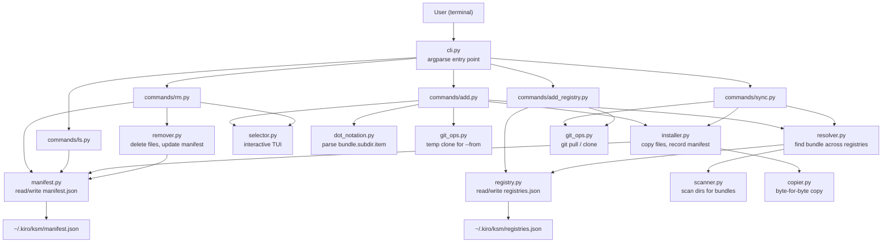

# Design Document: Kiro Settings Manager (`ksm`)

## Overview

The Kiro Settings Manager is a Python CLI tool (`ksm`) that manages Kiro IDE configuration bundles. It replaces the existing shell scripts (`install-steering-and-skills.sh`, `sync-to-kiro-settings.sh`) with a structured, registry-aware package manager for configuration files.

The tool resolves bundles from one or more registries (a built-in default plus user-added git repos), copies recognised subdirectories (`skills/`, `steering/`, `hooks/`, `agents/`) into a target `.kiro/` directory, and persists registry and installation metadata as JSON files under `~/.kiro/ksm/`.

Key design goals:
- Pure Python with no runtime dependencies beyond the standard library and `argparse`
- Byte-for-byte file copying with skip-if-identical optimisation
- Interactive terminal selector using raw `tty`/`termios` (no curses, no third-party TUI libs)
- Git operations via `subprocess` calls to the system `git` binary
- All state persisted as JSON; round-trip fidelity guaranteed

## Architecture



The architecture follows a layered approach:

1. **CLI layer** (`cli.py`) — Parses arguments, dispatches to command handlers.
2. **Command layer** (`commands/`) — One module per command (`add`, `ls`, `sync`, `add-registry`, `rm`). Orchestrates domain logic.
3. **Domain layer** — Pure-logic modules: `resolver.py`, `installer.py`, `remover.py`, `copier.py`, `scanner.py`, `dot_notation.py`, `manifest.py`, `registry.py`.
4. **Infrastructure layer** — Side-effectful modules: `git_ops.py` (subprocess git), `selector.py` (raw terminal I/O), `persistence.py` (JSON file I/O).

## Components and Interfaces

### Module: `cli.py`

Entry point registered as `ksm` via `pyproject.toml` `[project.scripts]`. Uses `argparse` with subparsers for each command.

```python
def main() -> None:
    """Parse args and dispatch to the appropriate command handler."""
```

Subcommands: `add`, `ls`, `sync`, `add-registry`, `rm`.
Global flags: `--version`, `--help`.

### Module: `commands/add.py`

Handles `ksm add <bundle_spec>` with flags `-l`, `-g`, `--display`, `--from`, `--skills-only`, `--agents-only`, `--steering-only`, `--hooks-only`.

```python
def run_add(args: argparse.Namespace) -> int:
    """Execute the add command. Returns exit code."""
```

Logic flow:
1. If `--display`, launch interactive selector → get bundle name.
2. Parse bundle spec (plain name or dot notation).
3. If `--from`, clone ephemeral registry.
4. Resolve bundle across registries.
5. Determine subdirectory filter set.
6. Delegate to `installer.install_bundle(...)`.
7. Clean up ephemeral clone if used.

### Module: `commands/ls.py`

```python
def run_ls(args: argparse.Namespace) -> int:
    """Read manifest and print installed bundles. Returns exit code."""
```

### Module: `commands/sync.py`

```python
def run_sync(args: argparse.Namespace) -> int:
    """Sync specified or all bundles. Returns exit code."""
```

Logic flow:
1. Validate at least one bundle name or `--all`.
2. Unless `--yes`, display confirmation prompt.
3. For git registries, pull latest.
4. Re-install each bundle via `installer.install_bundle(...)`.
5. Update manifest timestamps.

### Module: `commands/add_registry.py`

```python
def run_add_registry(args: argparse.Namespace) -> int:
    """Clone a git repo and register it. Returns exit code."""
```

### Module: `commands/rm.py`

Handles `ksm rm <bundle_name>` with flags `-l`, `-g`, `--display`.

```python
def run_rm(args: argparse.Namespace) -> int:
    """Execute the rm command. Returns exit code."""
```

Logic flow:
1. If `--display`, launch removal selector (showing only installed bundles) → get bundle name.
2. If no bundles are installed and `--display` was used, print message and exit 0.
3. Resolve scope from `-l`/`-g` flags (default: local).
4. Look up bundle in Install_Manifest by name and scope.
5. If not found, print error and exit 1.
6. Delegate to `remover.remove_bundle(...)`.
7. Save updated manifest.

### Module: `resolver.py`

Finds a bundle by name across all registered registries.

```python
@dataclass
class ResolvedBundle:
    name: str
    path: Path
    registry_name: str
    subdirectories: list[str]  # e.g. ["skills", "steering"]

def resolve_bundle(
    bundle_name: str,
    registry_index: RegistryIndex,
) -> ResolvedBundle:
    """Search all registries for a bundle. Raises BundleNotFoundError."""
```

### Module: `scanner.py`

Scans a directory for valid bundles (directories containing at least one recognised subdirectory).

```python
RECOGNISED_SUBDIRS: frozenset[str] = frozenset(
    {"skills", "steering", "hooks", "agents"}
)

def scan_registry(registry_path: Path) -> list[BundleInfo]:
    """Return all valid bundles found in a registry directory."""

@dataclass
class BundleInfo:
    name: str
    path: Path
    subdirectories: list[str]
```

### Module: `installer.py`

Orchestrates file copying and manifest updates.

```python
def install_bundle(
    bundle: ResolvedBundle,
    target_dir: Path,
    scope: Scope,
    subdirectory_filter: set[str] | None,
    dot_selection: DotSelection | None,
    manifest: Manifest,
    source_label: str,
) -> list[Path]:
    """Install bundle files and update manifest. Returns installed paths."""
```

### Module: `copier.py`

Low-level file copying with byte-for-byte fidelity and skip-if-identical.

```python
def copy_tree(
    src: Path, dst: Path, skip_identical: bool = True
) -> list[Path]:
    """Recursively copy src to dst. Returns list of copied file paths."""

def copy_file(src: Path, dst: Path, skip_identical: bool = True) -> bool:
    """Copy a single file. Returns True if copy occurred, False if skipped."""

def files_identical(a: Path, b: Path) -> bool:
    """Compare two files byte-for-byte."""
```

### Module: `remover.py`

Deletes installed files based on manifest entries and updates the manifest.

```python
@dataclass
class RemovalResult:
    removed_files: list[str]
    skipped_files: list[str]   # files that no longer existed on disk

def remove_bundle(
    entry: ManifestEntry,
    target_dir: Path,
    manifest: Manifest,
) -> RemovalResult:
    """Delete installed files and remove the manifest entry.

    For each file in entry.installed_files:
      - If the file exists on disk, delete it.
      - If the file does not exist, record it as skipped.
    After all files are processed, remove the entry from the manifest.
    Empty subdirectories are left in place.
    Returns a RemovalResult summarising what happened.
    """
```

### Module: `dot_notation.py`

Parses and validates `<bundle>.<subdir>.<item>` selectors.

```python
@dataclass
class DotSelection:
    bundle_name: str
    subdirectory: str
    item_name: str

def parse_dot_notation(spec: str) -> DotSelection | None:
    """Parse a dot-notation string. Returns None if spec is a plain name."""

def validate_dot_selection(
    selection: DotSelection,
) -> None:
    """Validate subdirectory is recognised. Raises InvalidSubdirectoryError."""
```

### Module: `registry.py`

Manages the registry index (read/write `registries.json`).

```python
@dataclass
class RegistryEntry:
    name: str
    url: str | None       # None for Default_Registry
    local_path: str
    is_default: bool

@dataclass
class RegistryIndex:
    registries: list[RegistryEntry]

def load_registry_index(path: Path) -> RegistryIndex:
    """Load from JSON. Creates default entry on first run."""

def save_registry_index(index: RegistryIndex, path: Path) -> None:
    """Write registry index to JSON."""
```

### Module: `manifest.py`

Manages the install manifest (read/write `manifest.json`).

```python
@dataclass
class ManifestEntry:
    bundle_name: str
    source_registry: str
    scope: str              # "local" | "global"
    installed_files: list[str]
    installed_at: str       # ISO 8601 timestamp
    updated_at: str         # ISO 8601 timestamp

@dataclass
class Manifest:
    entries: list[ManifestEntry]

def load_manifest(path: Path) -> Manifest:
    """Load from JSON. Returns empty manifest if file missing."""

def save_manifest(manifest: Manifest, path: Path) -> None:
    """Write manifest to JSON."""
```

### Module: `git_ops.py`

Wraps `git clone` and `git pull` via `subprocess`.

```python
def clone_repo(url: str, target_dir: Path) -> None:
    """Clone a git repo. Raises GitError on failure."""

def pull_repo(repo_dir: Path) -> None:
    """Pull latest in an existing repo. Raises GitError on failure."""

def clone_ephemeral(url: str) -> Path:
    """Clone to a tempdir. Caller must delete. Returns clone path."""
```

### Module: `selector.py`

Interactive terminal bundle selector using raw terminal mode (`tty`/`termios`).

```python
def interactive_select(
    bundles: list[BundleInfo],
    installed_names: set[str],
) -> str | None:
    """Show interactive selector for add. Returns selected bundle name or None."""

def interactive_removal_select(
    entries: list[ManifestEntry],
) -> ManifestEntry | None:
    """Show interactive selector for rm (installed bundles only).

    Displays bundles alphabetically with scope labels (local/global).
    Returns selected ManifestEntry or None if user quits.
    """
```

Rendering logic:
- `>` prefix on highlighted line
- Add selector: `[installed]` suffix for installed bundles
- Removal selector: `[local]`/`[global]` scope label next to each bundle
- Arrow keys navigate, Enter selects, `q`/Escape exits

### Module: `persistence.py`

Shared JSON I/O utilities.

```python
KSM_DIR: Path = Path.home() / ".kiro" / "ksm"
REGISTRIES_FILE: Path = KSM_DIR / "registries.json"
MANIFEST_FILE: Path = KSM_DIR / "manifest.json"

def ensure_ksm_dir() -> None:
    """Create ~/.kiro/ksm/ if it doesn't exist."""

def read_json(path: Path) -> dict | list:
    """Read and parse a JSON file."""

def write_json(path: Path, data: dict | list) -> None:
    """Write data as JSON to a file."""
```

## Data Models

### Registry Index (`~/.kiro/ksm/registries.json`)

```json
{
  "registries": [
    {
      "name": "default",
      "url": null,
      "local_path": "/absolute/path/to/config_bundles",
      "is_default": true
    },
    {
      "name": "team-configs",
      "url": "https://github.com/org/team-kiro-configs.git",
      "local_path": "/home/user/.kiro/ksm/cache/team-configs",
      "is_default": false
    }
  ]
}
```

Fields:
- `name` — Human-readable registry identifier. For custom registries, derived from the git URL's repo name.
- `url` — Git clone URL. `null` for the Default_Registry.
- `local_path` — Absolute path to the registry directory on disk.
- `is_default` — `true` only for the built-in `config_bundles/` registry.

### Install Manifest (`~/.kiro/ksm/manifest.json`)

```json
{
  "entries": [
    {
      "bundle_name": "aws",
      "source_registry": "default",
      "scope": "global",
      "installed_files": [
        "skills/aws-cross-account/SKILL.md",
        "steering/AWS-IAM.md",
        "steering/MCP-availability.md"
      ],
      "installed_at": "2025-01-15T10:30:00Z",
      "updated_at": "2025-01-15T10:30:00Z"
    }
  ]
}
```

Fields:
- `bundle_name` — Name of the installed bundle.
- `source_registry` — Name of the registry it came from. For `--from` installs, this is the git URL.
- `scope` — `"local"` or `"global"`.
- `installed_files` — Relative paths (from `.kiro/`) of all files installed by this bundle.
- `installed_at` — ISO 8601 timestamp of first installation.
- `updated_at` — ISO 8601 timestamp of last sync/reinstall.

### Bundle Spec Parsing

The `<bundle_spec>` argument to `ksm add` is parsed as follows:

```
bundle_spec := plain_name | dot_notation
plain_name  := [a-zA-Z0-9_-]+
dot_notation := plain_name "." subdir_type "." item_name
subdir_type := "skills" | "steering" | "hooks" | "agents"
item_name   := [a-zA-Z0-9_.-]+
```

### Scope Enum

```python
from enum import Enum

class Scope(Enum):
    LOCAL = "local"
    GLOBAL = "global"
```

### Package Layout

```
kiro-settings-manager/
├── pyproject.toml
├── src/
│   └── ksm/
│       ├── __init__.py          # __version__
│       ├── cli.py               # argparse entry point
│       ├── commands/
│       │   ├── __init__.py
│       │   ├── add.py
│       │   ├── ls.py
│       │   ├── sync.py
│       │   ├── add_registry.py
│       │   └── rm.py
│       ├── resolver.py
│       ├── scanner.py
│       ├── installer.py
│       ├── remover.py
│       ├── copier.py
│       ├── dot_notation.py
│       ├── registry.py
│       ├── manifest.py
│       ├── git_ops.py
│       ├── selector.py
│       ├── persistence.py
│       └── errors.py            # custom exceptions
├── tests/
│   ├── conftest.py              # Hypothesis profiles, shared fixtures
│   ├── test_cli.py
│   ├── test_rm.py
│   ├── test_resolver.py
│   ├── test_scanner.py
│   ├── test_installer.py
│   ├── test_remover.py
│   ├── test_copier.py
│   ├── test_dot_notation.py
│   ├── test_registry.py
│   ├── test_manifest.py
│   ├── test_git_ops.py
│   ├── test_selector.py
│   └── test_persistence.py
├── config_bundles/              # Default_Registry (existing)
└── scripts/
```

### `pyproject.toml` Configuration (Key Sections)

```toml
[project]
name = "kiro-settings-manager"
version = "0.1.0"
requires-python = ">=3.10"

[project.scripts]
ksm = "ksm.cli:main"

[project.optional-dependencies]
dev = [
    "pytest",
    "pytest-cov",
    "hypothesis",
    "black",
    "flake8",
    "flake8-pyproject",
    "mypy",
]

[tool.black]
line-length = 88

[tool.flake8]
max-line-length = 88
extend-ignore = ["E203", "W503"]
exclude = [".venv", ".git", "__pycache__", ".hypothesis", ".pytest_cache"]

[tool.mypy]
python_version = "3.12"
warn_return_any = true
warn_unused_configs = true
disallow_untyped_defs = true

[tool.pytest.ini_options]
testpaths = ["tests"]
```

## Correctness Properties

*A property is a characteristic or behavior that should hold true across all valid executions of a system — essentially, a formal statement about what the system should do. Properties serve as the bridge between human-readable specifications and machine-verifiable correctness guarantees.*

### Property 1: Scope flag determines target directory

*For any* combination of scope flags (`-l`, `-g`, or neither), the resolved target directory shall be the workspace `.kiro/` when `-l` is supplied or no flag is supplied, and `~/.kiro/` when `-g` is supplied.

**Validates: Requirements 1.2, 1.3, 1.4**

### Property 2: Unknown bundle produces error

*For any* bundle name string that does not match any bundle in any registered registry, `ksm add` shall exit with a non-zero status code and the error output shall contain the unknown bundle name.

**Validates: Requirements 1.5**

### Property 3: Manifest records exactly the installed files

*For any* successful installation (full bundle, filtered, or dot-notation), the Install_Manifest entry for that bundle shall list exactly the set of file paths that were actually copied to the target directory — no more, no fewer.

**Validates: Requirements 1.7, 10.9, 11.7**

### Property 4: Reinstallation is idempotent

*For any* bundle, installing it twice at the same scope shall produce the same set of files in the target directory and the same manifest entry (except for the `updated_at` timestamp).

**Validates: Requirements 1.8**

### Property 5: Selector presents all bundles sorted alphabetically

*For any* set of registries containing bundles, the interactive selector shall display every bundle exactly once, in case-insensitive alphabetical order by name.

**Validates: Requirements 2.1, 2.2**

### Property 6: Installed label accuracy

*For any* set of bundles and any set of installed bundle names, the selector render output shall display `[installed]` next to a bundle if and only if that bundle's name is in the installed set.

**Validates: Requirements 2.5**

### Property 7: Arrow key navigation wraps correctly

*For any* list of N bundles and any current selection index, pressing down shall advance the index by 1 (clamping at N-1), and pressing up shall decrease the index by 1 (clamping at 0).

**Validates: Requirements 2.6**

### Property 8: ls displays all manifest entries with required fields

*For any* non-empty Install_Manifest, `ksm ls` output shall contain the bundle name, scope, and source registry for every entry in the manifest.

**Validates: Requirements 3.1, 3.2**

### Property 9: Sync aborts on non-y confirmation

*For any* input string that is not exactly `"y"`, the sync confirmation prompt shall cause the sync operation to abort and the target files shall remain unchanged.

**Validates: Requirements 4.4**

### Property 10: Sync re-copies bundle files from source

*For any* installed bundle (or all installed bundles when `--all` is used), after a confirmed sync operation, every file in the target directory that belongs to that bundle shall be byte-identical to the corresponding source file in the registry.

**Validates: Requirements 4.6, 4.7**

### Property 11: Sync continues past unknown bundles

*For any* list of bundle names passed to `ksm sync` where some names are not in the manifest, the CLI shall print an error for each unknown name and still sync all recognised names successfully.

**Validates: Requirements 4.8**

### Property 12: Sync updates manifest timestamp

*For any* bundle that is successfully synced, the `updated_at` field in the manifest shall be updated to a timestamp no earlier than the start of the sync operation.

**Validates: Requirements 4.10**

### Property 13: Scanner identifies valid bundles

*For any* directory tree, the scanner shall return exactly those top-level subdirectories that contain at least one of `skills/`, `steering/`, `hooks/`, or `agents/` as immediate children.

**Validates: Requirements 5.2**

### Property 14: Duplicate registry is a no-op

*For any* git URL that is already present in the Registry_Index, running `ksm add-registry` with that URL shall not modify the Registry_Index and shall exit with zero status.

**Validates: Requirements 5.4**

### Property 15: Registry index JSON round-trip

*For any* valid `RegistryIndex` data structure, serializing it to JSON and then deserializing shall produce an equivalent data structure.

**Validates: Requirements 6.5**

### Property 16: Manifest JSON round-trip

*For any* valid `Manifest` data structure, serializing it to JSON and then deserializing shall produce an equivalent data structure.

**Validates: Requirements 6.6**

### Property 17: Only recognised subdirectories are copied

*For any* bundle containing a mix of recognised (`skills/`, `steering/`, `hooks/`, `agents/`) and unrecognised directories/files at its root, installation shall copy contents from recognised subdirectories only.

**Validates: Requirements 7.1**

### Property 18: File copy preserves structure and content

*For any* file within a bundle subdirectory, after installation the destination file shall exist at the same relative path under `.kiro/<subdirectory>/` and shall be byte-identical to the source file.

**Validates: Requirements 7.2, 7.3, 7.5**

### Property 19: Identical files are skipped

*For any* file that already exists at the destination with byte-identical content to the source, the copy operation shall skip that file (no write performed).

**Validates: Requirements 7.4**

### Property 20: Unknown CLI command produces error

*For any* string that is not one of the recognised commands (`add`, `ls`, `sync`, `add-registry`, `rm`), the CLI shall exit with a non-zero status code and the output shall list the valid commands.

**Validates: Requirements 8.5**

### Property 21: Ephemeral registry is not persisted

*For any* `ksm add --from <url>` invocation, the Registry_Index shall be identical before and after the command completes.

**Validates: Requirements 9.3**

### Property 22: Ephemeral clone is cleaned up

*For any* `ksm add --from <url>` invocation (whether it succeeds or fails), the temporary clone directory shall not exist after the command completes.

**Validates: Requirements 9.4**

### Property 23: Ephemeral source recorded as git URL

*For any* bundle installed via `--from <url>`, the `source_registry` field in the manifest entry shall equal the git URL string.

**Validates: Requirements 9.7**

### Property 24: Subdirectory filter restricts copied directories

*For any* set of subdirectory filter flags and any bundle, installation shall copy only the subdirectories corresponding to the active filters. When no filter is supplied, all recognised subdirectories are copied.

**Validates: Requirements 10.1, 10.2, 10.3, 10.4, 10.5, 10.6**

### Property 25: Warning for missing filtered subdirectory

*For any* bundle that lacks a subdirectory specified by a filter flag, the CLI shall emit a warning naming the missing subdirectory and continue installing any remaining applicable subdirectories.

**Validates: Requirements 10.7**

### Property 26: Error when all filters miss

*For any* bundle where none of the specified filter flags match an existing subdirectory, the CLI shall exit with a non-zero status code.

**Validates: Requirements 10.8**

### Property 27: Dot notation installs only the target item

*For any* valid dot-notation selector `<bundle>.<subdir>.<item>`, installation shall copy only the specified item (file or directory) from the specified subdirectory, and no other items.

**Validates: Requirements 11.1**

### Property 28: Dot notation validates subdirectory type

*For any* string used as the subdirectory component in dot notation, the CLI shall accept it if and only if it is one of `skills`, `agents`, `steering`, or `hooks`. All other values shall produce an error listing the valid types.

**Validates: Requirements 11.2, 11.3**

### Property 29: Dot notation missing item produces error

*For any* dot-notation selector where the item name does not exist in the specified subdirectory, the CLI shall exit with a non-zero status code and the error output shall contain the unknown item name.

**Validates: Requirements 11.4**

### Property 30: Dot notation copies correct item type

*For any* dot-notation selector, if the item is a directory the entire directory tree shall be copied, and if the item is a file only that file shall be copied.

**Validates: Requirements 11.5, 11.6**

### Property 31: Dot notation and subdirectory filter are mutually exclusive

*For any* command invocation that includes both a dot-notation selector and a subdirectory filter flag, the CLI shall exit with a non-zero status code and print an error explaining the mutual exclusivity.

**Validates: Requirements 11.9**

### Property 32: Removal deletes exactly the manifest-listed files

*For any* manifest entry and any set of files on disk matching that entry's `installed_files` list, running `ksm rm` for that bundle shall delete every file in the list that exists on disk, and no other files.

**Validates: Requirements 12.1**

### Property 33: Removal removes the manifest entry

*For any* bundle present in the Install_Manifest, after `ksm rm <bundle_name>` completes successfully, the manifest shall no longer contain an entry for that bundle at the removed scope.

**Validates: Requirements 12.2**

### Property 34: Unknown bundle in rm produces error

*For any* bundle name string that does not match any entry in the Install_Manifest, `ksm rm` shall exit with a non-zero status code and the error output shall contain the unknown bundle name.

**Validates: Requirements 12.3**

### Property 35: Rm scope flag determines target directory

*For any* combination of scope flags (`-l`, `-g`, or neither), the resolved target directory for removal shall be the workspace `.kiro/` when `-l` is supplied or no flag is supplied, and `~/.kiro/` when `-g` is supplied.

**Validates: Requirements 12.4, 12.5, 12.6**

### Property 36: Missing files on disk are skipped gracefully

*For any* manifest entry where a subset of the listed files no longer exist on disk, `ksm rm` shall skip the missing files without error and still delete all remaining files that do exist.

**Validates: Requirements 12.7**

### Property 37: Empty subdirectories are preserved after removal

*For any* bundle removal that results in an empty `.kiro/` subdirectory (e.g. `skills/`, `steering/`), the empty subdirectory shall still exist on disk after the removal completes.

**Validates: Requirements 12.8**

### Property 38: Removal selector shows installed bundles with scope labels sorted alphabetically

*For any* non-empty Install_Manifest, the removal selector shall display exactly the bundles present in the manifest, in case-insensitive alphabetical order by name, with each entry showing its scope label (`local` or `global`).

**Validates: Requirements 12.9, 12.10, 12.13**

## Error Handling

| Scenario | Behaviour | Exit Code |
|---|---|---|
| Bundle not found in any registry | Print error naming the bundle | 1 |
| Git clone fails (`add-registry`, `--from`) | Print error with git stderr | 1 |
| Bundle not found in ephemeral clone | Print error, delete temp dir | 1 |
| Unknown CLI command | Print error listing valid commands | 2 |
| All subdirectory filters miss | Print error listing missing subdirs | 1 |
| Invalid subdirectory in dot notation | Print error listing valid types | 1 |
| Item not found in dot notation | Print error naming the item | 1 |
| Dot notation + subdirectory filter combined | Print mutual exclusivity error | 1 |
| Bundle not in manifest during sync | Print warning, continue with others | 0 (partial) |
| Sync aborted by user (`n`) | Print abort message | 0 |
| Sync with no args and no `--all` | Print usage message | 1 |
| Registry already registered | Print info message | 0 |
| `~/.kiro/ksm/` directory missing | Create automatically | N/A |
| Target `.kiro/` subdirectory missing | Create automatically | N/A |
| File I/O error during copy | Print error with path and OS message | 1 |
| Bundle not in manifest during rm | Print error naming the bundle | 1 |
| File missing on disk during rm | Skip file, continue with remaining | 0 |
| No bundles installed (`rm --display`) | Print info message | 0 |

All error messages are written to stderr. Success messages are written to stdout.

## Testing Strategy

### Dual Testing Approach

The project uses both unit tests and property-based tests for comprehensive coverage:

- **Unit tests** (`pytest`): Verify specific examples, edge cases, error conditions, and integration points. Focus on concrete scenarios like "install the `aws` bundle and check the files exist."
- **Property-based tests** (`hypothesis`): Verify universal properties across randomly generated inputs. Focus on invariants like "for any valid manifest, round-trip serialization produces an equivalent object."

Both are complementary and required. Unit tests catch concrete bugs; property tests verify general correctness across the input space.

### Property-Based Testing Configuration

- Library: **Hypothesis** (Python)
- Profiles configured in `tests/conftest.py`:
  - `dev` profile: `max_examples=15`, `deadline=None` (local development)
  - `ci` profile: `max_examples=100`, `deadline=None` (CI/CD)
- Profile selected via `HYPOTHESIS_PROFILE` environment variable, defaulting to `dev`
- Each property test must be tagged with a comment referencing the design property:
  ```python
  # Feature: kiro-settings-manager, Property 15: Registry index JSON round-trip
  ```

### Test Organisation

Tests mirror the `src/ksm/` module structure:

| Module | Test File | Key Focus |
|---|---|---|
| `cli.py` | `test_cli.py` | Argument parsing, command dispatch, help/version output |
| `commands/add.py` | `test_add.py` | Add flow orchestration, flag combinations |
| `commands/ls.py` | `test_ls.py` | Manifest display formatting |
| `commands/sync.py` | `test_sync.py` | Confirmation prompt, sync flow |
| `commands/add_registry.py` | `test_add_registry.py` | Registry registration flow |
| `commands/rm.py` | `test_rm.py` | Rm flow orchestration, scope flags, display mode |
| `resolver.py` | `test_resolver.py` | Bundle lookup across registries |
| `scanner.py` | `test_scanner.py` | Bundle detection in directory trees |
| `installer.py` | `test_installer.py` | Installation orchestration, manifest updates |
| `remover.py` | `test_remover.py` | File deletion, manifest entry removal, skip missing |
| `copier.py` | `test_copier.py` | File copying, skip-identical, byte fidelity |
| `dot_notation.py` | `test_dot_notation.py` | Parsing, validation |
| `registry.py` | `test_registry.py` | Registry index CRUD, round-trip |
| `manifest.py` | `test_manifest.py` | Manifest CRUD, round-trip |
| `git_ops.py` | `test_git_ops.py` | Git subprocess mocking |
| `selector.py` | `test_selector.py` | Render output, navigation state |
| `persistence.py` | `test_persistence.py` | JSON I/O, directory creation |

### Property Test to Module Mapping

| Property | Module Under Test |
|---|---|
| 1 (Scope flag) | `commands/add.py` |
| 2 (Unknown bundle error) | `resolver.py` |
| 3 (Manifest accuracy) | `installer.py`, `manifest.py` |
| 4 (Idempotent reinstall) | `installer.py`, `copier.py` |
| 5 (Selector sorted) | `selector.py` |
| 6 (Installed label) | `selector.py` |
| 7 (Arrow navigation) | `selector.py` |
| 8 (ls output) | `commands/ls.py` |
| 9 (Sync abort) | `commands/sync.py` |
| 10 (Sync re-copies) | `commands/sync.py`, `copier.py` |
| 11 (Sync unknown bundles) | `commands/sync.py` |
| 12 (Sync timestamp) | `commands/sync.py`, `manifest.py` |
| 13 (Scanner) | `scanner.py` |
| 14 (Duplicate registry) | `registry.py` |
| 15 (Registry round-trip) | `registry.py`, `persistence.py` |
| 16 (Manifest round-trip) | `manifest.py`, `persistence.py` |
| 17 (Recognised subdirs only) | `installer.py`, `scanner.py` |
| 18 (Copy fidelity) | `copier.py` |
| 19 (Skip identical) | `copier.py` |
| 20 (Unknown command) | `cli.py` |
| 21 (Ephemeral not persisted) | `commands/add.py`, `registry.py` |
| 22 (Ephemeral cleanup) | `git_ops.py`, `commands/add.py` |
| 23 (Ephemeral source URL) | `installer.py`, `manifest.py` |
| 24 (Subdirectory filter) | `installer.py` |
| 25 (Missing filter warning) | `installer.py` |
| 26 (All filters miss error) | `installer.py` |
| 27 (Dot notation target only) | `installer.py`, `dot_notation.py` |
| 28 (Dot notation validation) | `dot_notation.py` |
| 29 (Dot notation missing item) | `installer.py` |
| 30 (Dot notation item type) | `copier.py`, `installer.py` |
| 31 (Mutual exclusion) | `commands/add.py`, `cli.py` |
| 32 (Removal deletes files) | `remover.py` |
| 33 (Removal removes manifest entry) | `remover.py`, `manifest.py` |
| 34 (Unknown bundle in rm) | `commands/rm.py`, `manifest.py` |
| 35 (Rm scope flag) | `commands/rm.py` |
| 36 (Missing files skipped) | `remover.py` |
| 37 (Empty subdirs preserved) | `remover.py` |
| 38 (Removal selector) | `selector.py`, `commands/rm.py` |

### Coverage Target

- Minimum **95%** statement, branch, function, and line coverage across all `src/ksm/` modules
- Coverage measured with `pytest-cov`
- `selector.py` raw terminal I/O tested via mocked `stdin`/`stdout`; `git_ops.py` tested via mocked `subprocess`

### Each correctness property MUST be implemented by a SINGLE property-based test

Each of the 38 properties above maps to exactly one `@given(...)` test function. The test function is tagged with a comment in the format:

```python
# Feature: kiro-settings-manager, Property 15: Registry index JSON round-trip
@given(registry_index=registry_index_strategy())
def test_registry_index_round_trip(registry_index: RegistryIndex) -> None:
    ...
```
