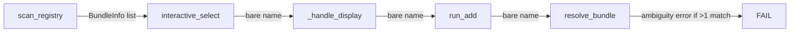
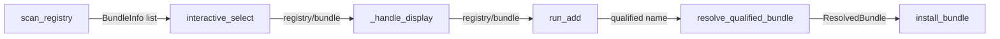

# Design Document: Registry-Aware Interactive Add

## Overview

The `ksm add -i` interactive selector currently discards registry information when returning selected bundle names. When a bundle exists in multiple registries, the bare name causes an ambiguity error in the resolver. This design makes the interactive selection pipeline registry-aware end-to-end by:

1. Always displaying registry origin alongside bundle names in both TUI and fallback selectors
2. Returning qualified `registry_name/bundle_name` strings from the selector
3. Passing qualified names through `_handle_display()` so the resolver can use `resolve_qualified_bundle()` directly

The changes are scoped to the selector/display layer. The resolver, installer, and manifest modules remain unchanged.

## Architecture

The data flow for `ksm add -i` currently looks like:



After this change:



The key insight is that `BundleInfo` already carries `registry_name`. We just need to thread it through the display and return paths.

## Components and Interfaces

### Modified Functions

#### `render_add_selector()` in `selector.py`

Current behavior: Shows `registry/bundle` only for ambiguous names. Returns display lines with bundle name as the primary text.

New behavior: Always shows two-column layout — bundle name left (bold), registry name right (dimmed). The registry column is right-aligned with consistent padding.

```python
def render_add_selector(
    bundles: list[BundleInfo],
    installed_names: set[str],
    selected: int,
    filter_text: str = "",
    multi_selected: set[int] | None = None,
) -> list[str]:
```

Signature unchanged. Internal rendering changes:
- Remove ambiguity detection logic (`name_counts`, `ambiguous` set)
- Build display as `bundle_name` padded + dimmed `registry_name`
- Filter matches against both `bundle.name` and `bundle.registry_name`
- Sort by `(bundle_name, registry_name)` for stable ordering
- Skip registry column when `registry_name` is empty

#### `interactive_select()` in `selector.py`

Current behavior: Returns `list[str]` of bare bundle names.

New behavior: Returns `list[str]` of qualified `registry_name/bundle_name` strings. If `registry_name` is empty, returns bare `bundle_name`.

```python
def interactive_select(
    bundles: list[BundleInfo],
    installed_names: set[str],
) -> list[str] | None:
```

Signature unchanged. Changes:
- Fallback path: build qualified name from selected `BundleInfo`
- TUI path: `BundleSelectorApp` already receives full `BundleInfo` list; `selected_names` will contain qualified names

#### `_numbered_list_select()` in `selector.py`

No signature change. The `items` parameter already accepts `list[tuple[str, str]]` where the second element is a label. The caller will now pass `(registry_name)` as the label for each item, and the function will display it as `bundle_name  (registry_name)`.

#### `BundleSelectorApp._build_display_items()` in `tui.py`

Current behavior: Prefixes `registry/` only for ambiguous names.

New behavior: Always stores `(display_name, bundle)` where `display_name` is the bundle name. The registry name is rendered as a separate dimmed column in `_refresh_options()`.

#### `BundleSelectorApp._confirm_selection()` in `tui.py`

Current behavior: Sets `selected_names` to bare `bundle.name`.

New behavior: Sets `selected_names` to `f"{bundle.registry_name}/{bundle.name}"` when `registry_name` is non-empty, otherwise bare `bundle.name`.

#### `BundleSelectorApp._refresh_options()` in `tui.py`

Current behavior: Renders display name (which may include `registry/` prefix for ambiguous bundles).

New behavior: Renders bundle name in bold cyan, then appends registry name in dim style to the right, padded for column alignment.

#### `BundleSelectorApp.on_input_changed()` in `tui.py`

Current behavior: Filters on `display_name` (which is `registry/bundle` for ambiguous, `bundle` otherwise).

New behavior: Filters on both `bundle.name` and `bundle.registry_name` (case-insensitive substring match on either).

#### `_handle_display()` in `commands/add.py`

Current behavior: Returns `result[0]` which is a bare name.

New behavior: Returns `result[0]` which is now a qualified name. No logic change needed — it's a pass-through.

### Unchanged Functions

- `resolve_bundle()` — still used for unqualified CLI input
- `resolve_qualified_bundle()` — already exists, already used by `run_add()` when `parse_qualified_name()` detects a `/`
- `run_add()` — already calls `parse_qualified_name()` and dispatches to `resolve_qualified_bundle()` when a registry prefix is present
- `parse_qualified_name()` — already parses `registry/bundle` format
- `scan_registry()` — already populates `registry_name` on `BundleInfo`
- `install_bundle()` — unchanged
- Manifest read/write — unchanged

## Data Models

### `BundleInfo` (unchanged)

```python
@dataclass
class BundleInfo:
    name: str
    path: Path
    subdirectories: list[str]
    registry_name: str = ""
```

Already carries `registry_name`. No changes needed.

### Qualified Name Format

A qualified name is a string in the format `registry_name/bundle_name`. It is produced by the selector and consumed by `parse_qualified_name()` in the resolver.

Rules:
- If `registry_name` is non-empty: `f"{registry_name}/{bundle_name}"`
- If `registry_name` is empty: bare `bundle_name` (no leading `/`)

### Display Formats

| Context | Format | Example |
|---------|--------|---------|
| TUI option row | `bundle_name` (bold) + padded + `registry_name` (dim) | `aws-tools          my-registry` |
| Fallback numbered list | `bundle_name  (registry_name)` | `aws-tools  (my-registry)` |
| TUI return value | `registry_name/bundle_name` | `my-registry/aws-tools` |
| Fallback return value | `registry_name/bundle_name` | `my-registry/aws-tools` |
| `[installed]` check | Match on bare `bundle.name` against manifest | `bundle.name in installed_names` |


## Correctness Properties

*A property is a characteristic or behavior that should hold true across all valid executions of a system — essentially, a formal statement about what the system should do. Properties serve as the bridge between human-readable specifications and machine-verifiable correctness guarantees.*

### Property 1: Display contains bundle name and registry name

*For any* list of `BundleInfo` objects with non-empty `registry_name`, the rendered selector output (both `render_add_selector` lines and fallback items) shall contain both the `bundle.name` and the `bundle.registry_name` for each bundle in the list.

**Validates: Requirements 1.1, 1.3**

### Property 2: Installed detection uses bare name

*For any* `BundleInfo` and any `installed_names` set, the `[installed]` indicator in the rendered output shall appear if and only if `bundle.name` is in `installed_names`, regardless of `registry_name` or display format.

**Validates: Requirements 1.4**

### Property 3: Qualified name round-trip

*For any* `BundleInfo` with a non-empty `registry_name`, building the qualified name as `f"{registry_name}/{bundle_name}"` and then parsing it with `parse_qualified_name()` shall return `(registry_name, bundle_name)`. For any `BundleInfo` with an empty `registry_name`, the qualified name shall be the bare `bundle_name` with no leading `/`.

**Validates: Requirements 2.1, 2.2, 2.4, 2.5, 1.5**

### Property 4: Duplicate bundle names produce separate items

*For any* list of `BundleInfo` objects where the same `bundle.name` appears with different `registry_name` values, the rendered selector output shall contain one selectable item per `BundleInfo` (no deduplication).

**Validates: Requirements 4.1**

### Property 5: Filter matches both bundle name and registry name

*For any* filter string and list of `BundleInfo` objects, the filtered result set shall include a bundle if and only if the filter string is a case-insensitive substring of either `bundle.name` or `bundle.registry_name`.

**Validates: Requirements 5.1**

### Property 6: Qualified name resolves to correct registry

*For any* registry index containing a bundle that exists in multiple registries, resolving a qualified name `registry_name/bundle_name` via `resolve_qualified_bundle()` shall return a `ResolvedBundle` whose `registry_name` matches the specified registry.

**Validates: Requirements 3.3, 4.2**

## Error Handling

| Scenario | Handling |
|----------|----------|
| `BundleInfo.registry_name` is empty | Display bare name, return bare name. No `/` prefix. |
| No bundles available | `interactive_select()` returns `None`. Caller exits cleanly. |
| User cancels selection (q/Esc/EOF) | Returns `None`. `_handle_display()` returns `None`. `run_add()` returns 0. |
| Qualified name not found in registry | `resolve_qualified_bundle()` raises `BundleNotFoundError`. `run_add()` prints error and returns 1. (Existing behavior, unchanged.) |
| Textual import fails | Falls back to `_numbered_list_select()`. (Existing behavior, unchanged.) |
| Filter produces zero matches | TUI shows "No bundles match" disabled option. Fallback shows empty list. (Existing behavior, unchanged.) |

No new error paths are introduced. The only new edge case is empty `registry_name`, which is handled defensively by skipping the registry column and returning bare names.

## Testing Strategy

### Property-Based Testing

Use **Hypothesis** (already a dev dependency) for property-based tests. Each property test references its design document property.

Configuration: Use the existing two-tier Hypothesis profile setup (`dev` = 15 examples, `ci` = 100 examples) from `conftest.py`.

Each property test must be tagged with a comment:
```python
# Feature: registry-aware-interactive-add, Property N: <title>
```

Properties to implement as property-based tests:

| Property | Test Strategy |
|----------|---------------|
| 1: Display contains both names | Generate random `BundleInfo` lists with non-empty `registry_name`. Call `render_add_selector()`. Assert each bundle's name and registry appear in the output lines. |
| 2: Installed detection uses bare name | Generate random bundles and random `installed_names` subsets. Call `render_add_selector()`. Assert `[installed]` appears iff `bundle.name in installed_names`. |
| 3: Qualified name round-trip | Generate random `(registry_name, bundle_name)` pairs. Build qualified name. Parse with `parse_qualified_name()`. Assert round-trip equality. Also test empty `registry_name` produces bare name. |
| 4: Duplicate names produce separate items | Generate bundles with duplicate names across registries. Call `render_add_selector()`. Assert line count equals bundle count (minus header lines). |
| 5: Filter matches both fields | Generate random bundles and a filter substring. Call `render_add_selector()` with filter. Assert result set matches expected filter logic. |
| 6: Qualified resolves correctly | Build a `RegistryIndex` with duplicate bundles. Call `resolve_qualified_bundle()`. Assert returned `registry_name` matches input. |

### Unit Tests

Unit tests cover specific examples, edge cases, and integration points:

- Empty `registry_name` edge case: display shows bare name, return is bare name
- Cancellation returns `None`
- `_handle_display()` passes qualified name through unchanged
- Backward compatibility: `run_add()` with bare name still calls `resolve_bundle()`
- Backward compatibility: `run_add()` with `registry/bundle` still calls `resolve_qualified_bundle()`
- Fallback selector format: `bundle_name  (registry_name)` with `[installed]` label
- TUI `_confirm_selection()` builds correct qualified names for single and multi-select

### Test File

All tests for this feature go in `tests/test_registry_aware_selector.py`, with Hypothesis strategies for generating `BundleInfo` objects with varied `registry_name` values.
