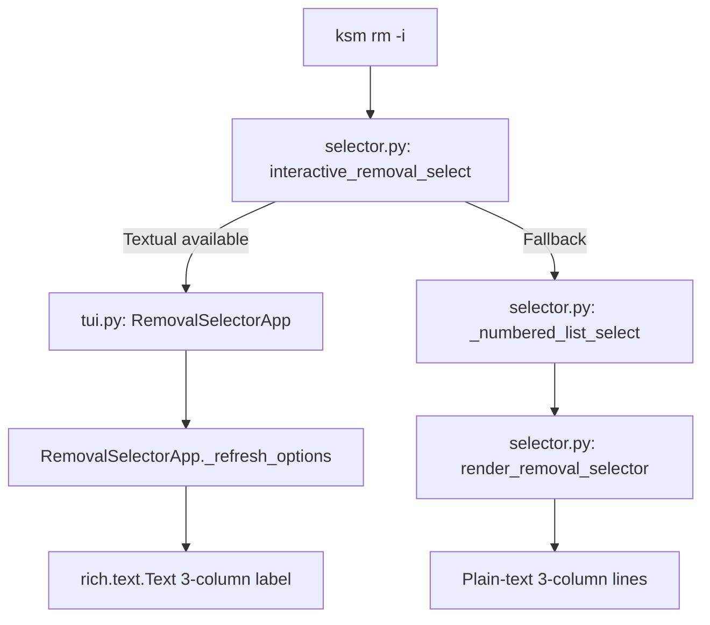

# Design Document: Remove Interactive UI Uplift

## Overview

Uplift the `ksm remove -i` interactive selector to display a 3-column layout: bundle name, scope (local/global), and source registry. Currently the removal selector (both Textual TUI `RemovalSelectorApp` and the numbered-list fallback) shows only bundle name and scope. This change adds the registry column and extends the filter to match against registry names.

The add-command's `BundleSelectorApp` already displays registry info as a dim column, so the removal selector follows the same pattern for consistency.

### Key Design Decisions

1. **Refactor existing code** — modify `render_removal_selector()`, `RemovalSelectorApp._refresh_options()`, `interactive_removal_select()` fallback path, and `_numbered_list_select()` rather than creating new components.
2. **Column formatting** — use the existing `_align_columns()` helper from `color.py` where practical; for the Textual TUI, use `rich.text.Text` padding (matching `BundleSelectorApp` pattern).
3. **Filter extension** — add `source_registry` to the filter predicate in both `RemovalSelectorApp.on_input_changed()` and `render_removal_selector()`.
4. **Empty registry handling** — when `source_registry` is empty string, the registry column renders as blank (no placeholder text).

## Architecture

The change touches three layers, all within existing modules:



No new modules or classes are introduced. The data model (`ManifestEntry`) already carries `source_registry`.

## Components and Interfaces

### 1. `render_removal_selector()` (selector.py)

**Current signature** (unchanged):
```python
def render_removal_selector(
    entries: list[ManifestEntry],
    selected: int,
    filter_text: str = "",
    multi_selected: set[int] | None = None,
) -> list[str]:
```

**Changes:**
- Compute `max_name`, `max_scope`, and `max_registry` column widths from filtered entries.
- Append a dim registry column after the scope column, padded to `max_registry`.
- When `source_registry` is empty, render blank space of equivalent width.
- Filter predicate: match `filter_text` against both `bundle_name` and `source_registry` (case-insensitive).

### 2. `RemovalSelectorApp._refresh_options()` (tui.py)

**Changes:**
- Compute `max_name` across `filtered_entries` for name padding.
- Compute `max_scope` across `filtered_entries` for scope padding.
- Build each `rich.text.Text` label with three segments: bold cyan name (padded), dim scope bracket (padded), dim registry.
- When `source_registry` is empty, omit the registry segment.

### 3. `RemovalSelectorApp.on_input_changed()` (tui.py)

**Changes:**
- Extend filter predicate from `ft in e.bundle_name.lower()` to also include `ft in e.source_registry.lower()`.

### 4. `interactive_removal_select()` fallback path (selector.py)

**Changes:**
- Build `items` tuples with 3-column formatted strings: `(name_padded, "[scope]  registry")`.
- Compute column widths from `sorted_entries` before building items.
- When `source_registry` is empty, omit registry text.

### 5. `_numbered_list_select()` (selector.py)

**No changes needed.** The function already renders `(name, label)` tuples. The caller (`interactive_removal_select`) will pass pre-formatted label strings containing scope and registry.

## Data Models

No data model changes. `ManifestEntry` already has all required fields:

```python
@dataclass
class ManifestEntry:
    bundle_name: str
    source_registry: str  # already present
    scope: str            # "local" | "global"
    installed_files: list[str]
    installed_at: str
    updated_at: str
    version: str | None = None
```

The `source_registry` field may be an empty string when a bundle was installed from an ephemeral source (e.g. `--from` URL). The design handles this by rendering blank space in the registry column.

## Correctness Properties

*A property is a characteristic or behavior that should hold true across all valid executions of a system — essentially, a formal statement about what the system should do. Properties serve as the bridge between human-readable specifications and machine-verifiable correctness guarantees.*

### Property 1: Three-column content presence

*For any* list of ManifestEntry objects with non-empty `bundle_name` and `scope`, each bundle line in the output of `render_removal_selector()` shall contain the entry's `bundle_name`, a bracketed scope label (e.g. `[local]`), and — when `source_registry` is non-empty — the `source_registry` string. When `source_registry` is empty, no extra text appears after the scope column.

**Validates: Requirements 1.1, 1.4, 1.5, 3.1, 3.3**

### Property 2: Column alignment

*For any* list of ManifestEntry objects (with any valid `filter_text` and any `multi_selected` set), all bundle lines produced by `render_removal_selector()` shall have their scope bracket (`[`) starting at the same character position, and the column order shall be name → scope → registry (left to right). This holds regardless of varying name lengths, scope values, or registry lengths.

**Validates: Requirements 1.2, 1.3, 1.6, 2.4, 2.5, 3.2, 4.1**

### Property 3: Filter matches both name and registry

*For any* ManifestEntry and any case-insensitive substring of either its `bundle_name` or its `source_registry`, filtering the entry list by that substring shall include the entry in the results. Conversely, a filter string that is a substring of neither field shall exclude the entry.

**Validates: Requirements 5.1, 5.2**

## Error Handling

No new error paths are introduced. Existing error handling covers:

- **Empty entry list**: `interactive_removal_select()` already returns `None` for empty lists.
- **No filter matches**: Both `RemovalSelectorApp` and `render_removal_selector()` already handle zero-match states (disabled "No bundles match" option in TUI, empty bundle lines in plain text).
- **Empty `source_registry`**: Handled by rendering blank space — no error raised.
- **Non-TTY / TERM=dumb**: Existing `_can_run_textual()` fallback logic is unchanged.

## Testing Strategy

### Property-Based Testing

Use **Hypothesis** (already a dev dependency) for property tests. Each property maps to a single `@given` test.

- **Library**: `hypothesis` with `hypothesis.strategies`
- **Profiles**: Use existing `conftest.py` profiles (`dev`: 15 examples, `ci`: 100 examples)
- **Generator**: Build a custom `ManifestEntry` strategy generating random `bundle_name` (alphanumeric + underscore/hyphen, 1–30 chars), `scope` (sampled from `["local", "global"]`), and `source_registry` (either empty string or alphanumeric 1–20 chars).

Property test tags:
- `Feature: remove-interactive-ui-uplift, Property 1: Three-column content presence`
- `Feature: remove-interactive-ui-uplift, Property 2: Column alignment`
- `Feature: remove-interactive-ui-uplift, Property 3: Filter matches both name and registry`

Each property test must reference its design document property via a docstring tag.

### Unit Tests

Unit tests complement property tests for specific examples and edge cases:

- Verify exact output for a known 2-entry list (one local, one global, different registries).
- Verify empty `source_registry` produces no trailing text.
- Verify TUI `RemovalSelectorApp` renders registry column in option labels.
- Verify TUI filter matches by registry name only.
- Verify fallback numbered-list includes registry in label text.

### Dual Approach

- **Property tests**: Verify universal alignment, content presence, and filter correctness across randomised inputs.
- **Unit tests**: Verify specific examples, TUI integration, edge cases (empty registry, single entry, all same scope).
- Both are required for comprehensive coverage.
