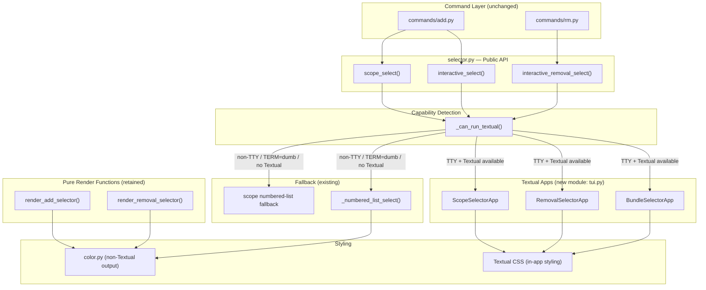
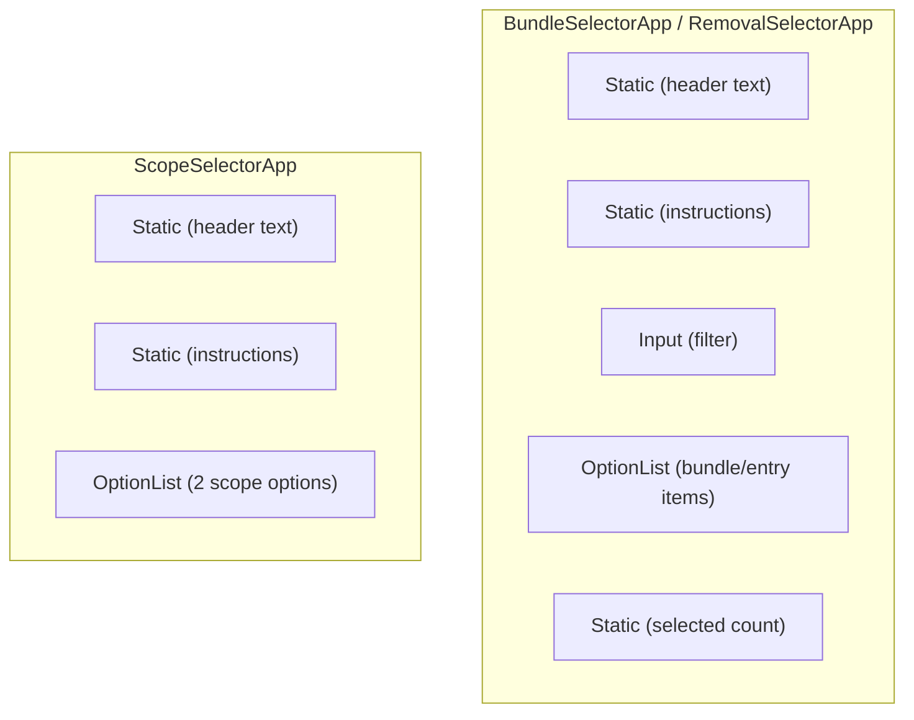
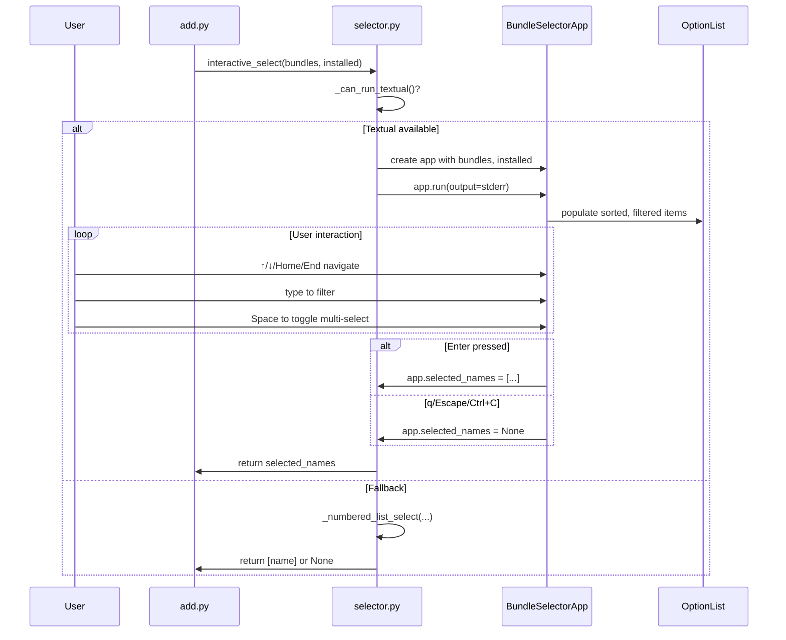

# Design: Textual TUI Refactor

## Overview

This design replaces the hand-rolled raw `tty`/`termios` terminal UI in `src/ksm/selector.py` with the Textual TUI library. The current implementation manually manages ANSI escape sequences, alternate screen buffers, cursor visibility, raw mode, and keypress reading — all of which are fragile and hard to maintain. Textual provides a robust widget-based framework that handles terminal lifecycle, input, rendering, and styling.

Three Textual apps replace the three raw-mode interactive paths:

| Current Function | Textual App | Purpose |
|---|---|---|
| `interactive_select()` raw-mode path | `BundleSelectorApp` | Bundle selection for `ksm add -i` |
| `interactive_removal_select()` raw-mode path | `RemovalSelectorApp` | Bundle removal for `ksm rm -i` |
| `scope_select()` raw-mode path | `ScopeSelectorApp` | Scope selection (local/global) |

The public API of `selector.py` is preserved — `interactive_select()`, `interactive_removal_select()`, `scope_select()`, and `clamp_index()` keep their signatures. Command modules (`add.py`, `rm.py`) require zero changes. The pure render functions (`render_add_selector`, `render_removal_selector`) are retained for unit testing outside of Textual.

The numbered-list fallback remains for non-TTY, `TERM=dumb`, and missing-Textual environments. `color.py` continues to serve non-Textual output (errors, diff summaries, success prefixes). Textual apps use Textual CSS for all in-app styling.

## Architecture



### Key Architectural Decisions

1. **New `tui.py` module**: Textual App subclasses live in `src/ksm/tui.py`, not in `selector.py`. This keeps `selector.py` as the thin public API layer and isolates Textual-specific code (widgets, CSS, event handlers) in a dedicated module. The import is guarded so Textual remains optional at import time.

2. **Lazy Textual import**: `selector.py` imports `tui.py` only inside the Textual path of each public function, after `_can_run_textual()` confirms Textual is available. This means `import ksm.selector` never fails even if Textual is not installed.

3. **stderr rendering**: All three Textual apps pass `output=sys.stderr` to the `App()` constructor, ensuring stdout stays clean for piped data.

4. **Ctrl+C handling**: Each public function wraps the `app.run()` call in a `try/except KeyboardInterrupt` that returns `None`, matching the existing abort behavior.

5. **`process_key()` removal**: This function is tightly coupled to raw-mode byte reading. It is removed from the public API. Tests that exercised it are replaced by Textual pilot-based tests and pure render function tests.

## Components and Interfaces

### Module: `src/ksm/selector.py` (refactored)

Retains the public API. Removes all `tty`/`termios` imports and raw-mode code. Adds `_can_run_textual()` replacing `_use_raw_mode()`.

```python
def _can_run_textual() -> bool:
    """Check if Textual can run.

    Returns False when:
    - stdin is not a TTY
    - TERM=dumb
    - Textual is not importable
    """

def interactive_select(
    bundles: list[BundleInfo],
    installed_names: set[str],
) -> list[str] | None:
    """Show interactive add-bundle selector.

    Returns list of selected bundle names, or None on abort.
    Delegates to BundleSelectorApp when Textual is available,
    otherwise falls back to numbered-list prompt.
    """

def interactive_removal_select(
    entries: list[ManifestEntry],
) -> list[ManifestEntry] | None:
    """Show interactive removal selector.

    Returns list of selected ManifestEntry objects, or None on abort.
    Delegates to RemovalSelectorApp when Textual is available,
    otherwise falls back to numbered-list prompt.
    """

def scope_select() -> str | None:
    """Interactive scope selection.

    Returns "local", "global", or None (abort).
    Delegates to ScopeSelectorApp when Textual is available,
    otherwise falls back to numbered-list prompt.
    """

def clamp_index(index: int, count: int) -> int:
    """Clamp an index to valid range [0, count-1]. Retained for compatibility."""

# Pure render functions — retained for testing
def render_add_selector(...) -> list[str]: ...
def render_removal_selector(...) -> list[str]: ...

# REMOVED: process_key(), _read_key(), _use_raw_mode()
# REMOVED: tty, termios imports
```

### Module: `src/ksm/tui.py` (new)

Contains all three Textual App subclasses and their widgets.

```python
from textual.app import App, ComposeResult
from textual.widgets import OptionList, Input, Header, Footer, Static
from textual.binding import Binding

class BundleSelectorApp(App):
    """Textual app for bundle selection.

    Attributes:
        bundles: list[BundleInfo] — available bundles
        installed_names: set[str] — already-installed bundle names
        selected_names: list[str] | None — result after exit
    """
    CSS = "..."  # or CSS_PATH = "tui.tcss"

    def compose(self) -> ComposeResult: ...
    def on_mount(self) -> None: ...
    # Key bindings: Enter, q, Escape, Space, Home, End
    # Filter input: on_input_changed handler

class RemovalSelectorApp(App):
    """Textual app for removal selection.

    Attributes:
        entries: list[ManifestEntry] — installed bundles
        selected_entries: list[ManifestEntry] | None — result after exit
    """

class ScopeSelectorApp(App):
    """Textual app for scope selection.

    Attributes:
        selected_scope: str | None — "local", "global", or None
    """
    # No filter input, no multi-select
    # No alternate screen buffer (inline=True)
```

### Widget Hierarchy



### Interaction Flow: Bundle Selection



### `q` Key Behavior Fix (Requirement 15.4)

The current implementation treats `q` as an unconditional abort, which breaks filtering (e.g., searching for "sql-queries"). The fix:

- In `BundleSelectorApp` and `RemovalSelectorApp`: the `q` key binding is only active when the filter `Input` widget is empty or unfocused. When the user is typing in the filter and presses `q`, it is treated as a filter character.
- Implementation: Use Textual's `on_key` event handler. Check if the `Input` widget has focus and contains text. If so, let the key pass through to the Input. If the Input is empty or unfocused, treat `q` as abort.
- In `ScopeSelectorApp`: `q` always aborts (no filter input exists).

```python
def on_key(self, event: events.Key) -> None:
    if event.key == "q":
        filter_input = self.query_one(Input)
        if filter_input.has_focus and filter_input.value:
            return  # let Input handle it
        self.selected_names = None
        self.exit()
```

### Filter State Management

When the filter text changes in `BundleSelectorApp` or `RemovalSelectorApp`:

1. The `OptionList` is repopulated with only matching items (case-insensitive substring)
2. The highlight resets to the first visible item (Req 3.5)
3. All multi-select toggles are cleared (Req 3.6)
4. If zero matches, an empty-state message is shown and Enter is disabled (Req 3.4)

### Multi-Select with Count Indicator

- Space toggles `[✓]`/`[ ]` on the highlighted item
- A `Static` widget in the footer area shows "N selected" when N > 0
- Enter with toggles returns all toggled items; Enter without toggles returns the highlighted item
- Filter changes clear all toggles

### Disambiguation of Ambiguous Bundle Names

When two or more bundles share the same `name` across different registries, the display name becomes `registry_name/bundle_name`. This logic already exists in `render_add_selector()` and is replicated in `BundleSelectorApp._build_display_items()`.


## Data Models

No new persistent data models are introduced. The refactor operates on existing types:

| Type | Module | Role in Selectors |
|---|---|---|
| `BundleInfo` | `scanner.py` | Input to `interactive_select()` — `name`, `path`, `subdirectories`, `registry_name` |
| `ManifestEntry` | `manifest.py` | Input to `interactive_removal_select()` — `bundle_name`, `scope`, `source_registry`, `installed_files`, timestamps |

### Internal State in Textual Apps

Each Textual app maintains transient state during its lifecycle:

```python
# BundleSelectorApp
class BundleSelectorApp(App):
    bundles: list[BundleInfo]           # input: all available bundles
    installed_names: set[str]           # input: already-installed names
    display_items: list[tuple[str, BundleInfo]]  # (display_name, bundle) sorted
    filtered_items: list[tuple[str, BundleInfo]] # after filter applied
    multi_selected: set[int]            # indices of toggled items
    selected_names: list[str] | None    # output: result after exit

# RemovalSelectorApp
class RemovalSelectorApp(App):
    entries: list[ManifestEntry]        # input: installed entries
    sorted_entries: list[ManifestEntry] # sorted alphabetically
    filtered_entries: list[ManifestEntry] # after filter applied
    multi_selected: set[int]            # indices of toggled items
    selected_entries: list[ManifestEntry] | None  # output: result

# ScopeSelectorApp
class ScopeSelectorApp(App):
    selected_scope: str | None          # output: "local", "global", or None
```

### Textual CSS Styling Approach

Styling is defined via the `CSS` class variable on each App (or a shared `.tcss` file). This keeps styling declarative and separate from widget logic.

```css
/* Shared selector styles */
.selector-header {
    text-style: bold;
    margin-bottom: 1;
}

.selector-instructions {
    text-style: dim;
    margin-bottom: 1;
}

OptionList > .option-list--option-highlighted {
    /* Textual's built-in highlight uses reverse-video,
       which works without color — satisfies NO_COLOR/Req 10.9 */
}

.installed-badge {
    text-style: dim;
}

.scope-label {
    text-style: dim;
}

.selected-count {
    text-style: bold;
    dock: bottom;
}
```

### Dependency Addition

In `pyproject.toml`, add `textual` as a runtime dependency:

```toml
[project]
dependencies = [
    "textual>=0.80.0",
]
```

This is the first and only new runtime dependency (Req 1.3). Textual's transitive dependencies (Rich, etc.) are pulled in automatically.

### Capability Detection: `_can_run_textual()`

Replaces `_use_raw_mode()`. Checks three conditions:

1. `sys.stdin.isatty()` — stdin must be a TTY
2. `os.environ.get("TERM") != "dumb"` — TERM must not be dumb
3. Textual is importable — `try: import textual; except ImportError: return False`

If any check fails, the public functions fall back to `_numbered_list_select()` or the scope numbered-list fallback.

### Terminal Cleanup

Textual manages terminal state through its application lifecycle. The `App.run()` method enters and exits the terminal context automatically. For additional safety:

- Each public function wraps `app.run()` in `try/except (KeyboardInterrupt, Exception)` to ensure cleanup on Ctrl+C and unexpected errors
- On `KeyboardInterrupt`, return `None` (abort)
- On unexpected exceptions, log to stderr and return `None`
- Textual's own cleanup handles cursor visibility, alternate screen buffer, and raw mode restoration

### Scope Selector: Inline Rendering

`ScopeSelectorApp` uses Textual's `inline=True` mode (or equivalent) to render without alternate screen buffer. This keeps the scope prompt visible alongside the bundle selection output above it. Only 2 options are shown — alternate screen would be disorienting.

### Home/End Key Support

All three apps bind `Home` and `End` keys to jump to the first and last item in the `OptionList`. Textual's `OptionList` widget supports this natively via its built-in key bindings.


## Correctness Properties

*A property is a characteristic or behavior that should hold true across all valid executions of a system — essentially, a formal statement about what the system should do. Properties serve as the bridge between human-readable specifications and machine-verifiable correctness guarantees.*

### Property 1: Bundle list sorting and installed-label accuracy

*For any* list of bundles with unique names and *for any* subset marked as installed, `render_add_selector()` shall produce bundle lines sorted alphabetically (case-insensitive), and each line shall contain `[installed]` if and only if that bundle's name is in the installed set.

**Validates: Requirements 2.2, 12.1**

### Property 2: Ambiguous bundle name disambiguation

*For any* list of bundles where two or more share the same `name` but have different `registry_name` values, `render_add_selector()` shall display those bundles using the qualified format `registry_name/bundle_name`, and bundles with unique names shall display without the registry prefix.

**Validates: Requirements 2.3**

### Property 3: Filter produces correct subset

*For any* list of bundles and *for any* non-empty filter string, `render_add_selector()` with that filter shall produce bundle lines containing only bundles whose display name includes the filter text as a case-insensitive substring. When the filter is empty, all bundles shall appear.

**Validates: Requirements 3.2, 3.3, 5.6**

### Property 4: Filter change resets highlight and clears toggles

*For any* selector state with a non-zero highlight index and non-empty multi-select set, when the filter text changes, the highlight shall reset to index 0 and the multi-select set shall be empty.

**Validates: Requirements 3.5, 3.6**

### Property 5: Enter returns toggled items or highlighted item

*For any* list of bundles and *for any* set of toggled indices, pressing Enter shall return exactly the bundle names at those toggled indices. When no items are toggled, Enter shall return a single-item list containing only the currently highlighted bundle name.

**Validates: Requirements 4.2, 4.3**

### Property 6: Selected count indicator accuracy

*For any* set of toggled items in the Bundle_Selector_App or Removal_Selector_App, the displayed selected-count value shall equal the cardinality of the toggled set.

**Validates: Requirements 4.4, 5.7**

### Property 7: Removal selector displays scope labels

*For any* list of ManifestEntry objects, `render_removal_selector()` shall produce lines sorted alphabetically by bundle name (case-insensitive), and each line shall contain the entry's scope in brackets (e.g., `[local]` or `[global]`).

**Validates: Requirements 5.2**

### Property 8: All selector UI renders to stderr only

*For any* invocation of `interactive_select()`, `interactive_removal_select()`, or `scope_select()` (both Textual and fallback paths), zero bytes shall be written to stdout. All UI content shall appear on stderr.

**Validates: Requirements 2.8, 5.8, 6.5, 11.1, 11.2, 11.3, 11.4**

### Property 9: Capability detection correctness

*For any* combination of (stdin is TTY: bool, TERM value: str, Textual importable: bool), `_can_run_textual()` shall return `True` if and only if all three conditions hold: stdin is a TTY, TERM is not `"dumb"`, and Textual is importable.

**Validates: Requirements 7.1, 7.2, 7.3, 8.6**

### Property 10: Numbered-list fallback returns correct item

*For any* list of items displayed in the numbered-list fallback, entering a valid 1-based index `n` shall return the item at 0-based index `n-1`. Entering `q` or EOF shall return None.

**Validates: Requirements 7.4**

### Property 11: clamp_index bounds

*For any* integer `index` and positive integer `count`, `clamp_index(index, count)` shall return a value in the range `[0, count-1]`.

**Validates: Requirements 9.4**

### Property 12: `q` key respects filter input state

*For any* non-empty filter text in the Bundle_Selector_App or Removal_Selector_App, pressing the `q` key shall append `q` to the filter text rather than triggering abort. When the filter text is empty, pressing `q` shall trigger abort and return None.

**Validates: Requirements 15.4**

## Error Handling

### Textual Import Failure

When `import textual` raises `ImportError` (Textual not installed), `_can_run_textual()` returns `False` and all public functions fall back to the numbered-list prompt. A debug-level message is logged to stderr indicating Textual is unavailable (Req 7.3).

### Textual App Crash

If `app.run()` raises an unexpected exception:

```python
try:
    app.run()
except KeyboardInterrupt:
    return None
except Exception as exc:
    print(f"Selector error: {exc}", file=sys.stderr)
    return None
```

The terminal is restored by Textual's context manager, and the function returns `None` (abort). The caller (`add.py`, `rm.py`) treats `None` as "user cancelled" and exits cleanly with code 0.

### Empty Input Lists

- `interactive_select([])` → returns `None` immediately, no app launched (Req 16.1)
- `interactive_removal_select([])` → returns `None` immediately (Req 16.2)

### Non-TTY stdin in Scope Fallback

When `scope_select()` falls back to numbered-list and stdin is not a TTY, it returns `None`. The caller in `add.py` defaults to `"local"` scope (Req 7.7).

### Invalid Fallback Input

The numbered-list fallback re-prompts on invalid input (non-numeric, out-of-range) with an error message to stderr (Req 7.5). This matches the existing `_numbered_list_select()` behavior.

## Testing Strategy

### Dual Testing Approach

Testing uses both unit/example tests and property-based tests:

- **Unit tests**: Verify specific interactions (Enter selects, q aborts, Ctrl+C returns None), edge cases (empty lists, single item), and code structure constraints (no tty/termios imports, process_key removed).
- **Property tests**: Verify universal properties across randomly generated inputs using Hypothesis. Each property test references its design document property.

### Property-Based Testing Configuration

- **Library**: Hypothesis (already a dev dependency)
- **Profiles**: `dev` (15 examples) for local development, `ci` (100 examples) for CI/CD — configured in `tests/conftest.py`
- **Minimum iterations**: 100 in CI profile
- **Tag format**: Each property test includes a docstring comment: `Feature: textual-tui-refactor, Property N: <property_text>`

### Test Organization

Tests live in `tests/test_selector.py` (updated) and `tests/test_tui.py` (new for Textual app tests).

**Pure render function tests** (`test_selector.py`):
- Property 1: Sorting and installed-label accuracy (existing tests updated)
- Property 2: Disambiguation (existing test updated)
- Property 3: Filter correctness
- Property 7: Removal selector scope labels (existing test updated)
- Property 11: clamp_index bounds (existing test retained)

**Textual app tests** (`test_tui.py`):
- Use Textual's `App.run_test()` / pilot harness for async interaction testing
- Property 4: Filter resets highlight and toggles
- Property 5: Enter returns correct items
- Property 6: Selected count accuracy
- Property 8: Stderr-only rendering
- Property 12: `q` key filter-aware behavior
- Example tests: Home/End navigation, Ctrl+C abort, scope selector defaults, inline rendering

**Capability detection tests** (`test_selector.py`):
- Property 9: `_can_run_textual()` correctness
- Property 10: Numbered-list fallback correctness

### Tests to Remove or Update

- All tests that mock `tty`/`termios`/`_read_key` in `test_selector.py` and `test_scope_select.py` are replaced by Textual pilot-based tests
- `test_process_key_*` tests are removed (function removed per Req 9.5)
- ANSI escape sequence tests (alternate screen buffer, cursor visibility) are removed — Textual manages these internally
- Existing property tests for `render_add_selector` and `render_removal_selector` are retained and updated

### Each Correctness Property Maps to a Single Property-Based Test

| Property | Test Location | Test Name |
|---|---|---|
| 1 | `test_selector.py` | `test_property_sorting_and_installed_labels` |
| 2 | `test_selector.py` | `test_property_disambiguation` |
| 3 | `test_selector.py` | `test_property_filter_subset` |
| 4 | `test_tui.py` | `test_property_filter_resets_state` |
| 5 | `test_tui.py` | `test_property_enter_returns_correct_items` |
| 6 | `test_tui.py` | `test_property_selected_count_accuracy` |
| 7 | `test_selector.py` | `test_property_removal_scope_labels` |
| 8 | `test_tui.py` | `test_property_stderr_only` |
| 9 | `test_selector.py` | `test_property_can_run_textual` |
| 10 | `test_selector.py` | `test_property_numbered_list_fallback` |
| 11 | `test_selector.py` | `test_property_clamp_index_bounds` |
| 12 | `test_tui.py` | `test_property_q_key_filter_aware` |
