# Design Document: UX Review Fixes

## Overview

This design addresses 35 requirements from the ksm CLI UX review (#[[file:docs/ux-review.md]]) and the CLI engineering review (#[[file:docs/steering/ksm-cli-review.md]]), covering the full spectrum from critical safety gaps to forward-looking suggestions. The changes touch every layer of the CLI: argument parsing (`cli.py`), command handlers (`commands/*.py`), interactive selectors (`selector.py`), error classes (`errors.py`), and introduce new modules for color output, registry management, typo suggestion, and signal handling.

The design is organized into eight implementation areas:

1. **Safety & Feedback** — Confirmation prompts, removal feedback, dry-run mode, TTY checks before prompts (Reqs 1, 2, 12, 31)
2. **Command Structure** — Registry subcommand group, `--only` flag, `--interactive` rename, curated help, new commands, mutually exclusive scope flags, global verbose/quiet (Reqs 4, 5, 8, 9, 11, 16, 17, 18, 19, 20, 21, 23, 27, 28)
3. **Output Quality** — Improved `ls`, color module, file-level diff after add/sync, informational messages to stderr (Reqs 6, 10, 22, 32)
4. **Error UX** — Actionable error messages with context, typo suggestions for unknown commands (Reqs 7, 24)
5. **Interactive Selectors** — Headers, type-to-filter, multi-select, render to stderr, cross-platform fallback, TERM=dumb fallback, alternate screen buffer (Reqs 3, 14, 15, 25, 26, 29, 30)
6. **Sync UX** — Specific confirmation messages (Req 13)
7. **Cleanup** — Empty directory removal after bundle removal, SIGINT handler for graceful cleanup (Reqs 33, 34)
8. **Help & Discoverability** — Help text examples for all commands, round-trip consistency of examples (Reqs 23, 35)

### Design Decisions

- **No external dependencies for color/terminal**: The color module uses raw ANSI codes. The interactive selector continues using `tty`/`termios` (Unix-only, per existing scope). Adding `prompt_toolkit` or similar is out of scope.
- **Cross-platform fallback for selector**: When `tty`/`termios` are unavailable (Windows) or `TERM=dumb`, the selector falls back to a numbered-list prompt that requires no terminal manipulation (Reqs 26, 29).
- **Backward compatibility for `--display`**: Kept as a hidden alias with deprecation warning, per Req 11.
- **`add-registry` removal**: The top-level `add-registry` command is removed entirely. The `registry` subcommand group replaces it (Req 4.3).
- **Hypothesis for property-based testing**: Already a dev dependency in `pyproject.toml`. All property tests use the existing profile configuration.
- **Refactoring over new code**: Where possible, existing functions are extended rather than creating parallel implementations. For example, `remove_bundle()` signature stays the same; the confirmation logic wraps it in `run_rm()`.
- **Selector renders to stderr**: All ANSI escape sequences and UI rendering go to `sys.stderr`, keeping stdout clean for piped data (Req 25).
- **Alternate screen buffer**: The selector uses `\033[?1049h`/`\033[?1049l` to preserve terminal history (Req 30).
- **Levenshtein distance for typo suggestions**: A pure-Python implementation (no external dependency) computes edit distance for unknown commands (Req 24).
- **SIGINT handler**: A module-level signal handler registered at CLI startup tracks active temp directories for cleanup (Req 34).
- **Mutually exclusive scope flags**: argparse's `add_mutually_exclusive_group()` enforces `-l`/`-g` exclusivity at the parser level (Req 27).
- **Help epilogs with examples**: Every subparser uses `RawDescriptionHelpFormatter` and an `epilog` with 2-3 concrete examples (Reqs 23, 35).

## Architecture

The changes are primarily additive modifications to existing modules, with several new modules introduced:

```mermaid
graph TD
    CLI[cli.py<br/>_build_parser / main] --> ADD[commands/add.py]
    CLI --> RM[commands/rm.py]
    CLI --> LS[commands/ls.py]
    CLI --> SYNC[commands/sync.py]
    CLI --> REG_ADD[commands/registry_add.py]
    CLI --> REG_LS[commands/registry_ls.py]
    CLI --> REG_RM[commands/registry_rm.py]
    CLI --> REG_INSPECT[commands/registry_inspect.py]
    CLI --> INIT[commands/init.py]
    CLI --> INFO[commands/info.py]
    CLI --> SEARCH[commands/search.py]
    CLI --> COMPLETIONS[commands/completions.py]
    CLI --> TYPO[typo_suggest.py]
    CLI --> SIGNAL[signal_handler.py]

    ADD --> INSTALLER[installer.py]
    ADD --> SELECTOR[selector.py]
    RM --> REMOVER[remover.py]
    RM --> SELECTOR
    SYNC --> INSTALLER

    ADD --> COLOR[color.py]
    RM --> COLOR
    LS --> COLOR
    SYNC --> COLOR
    SELECTOR --> COLOR

    INSTALLER --> COPIER[copier.py]
    
    CLI --> ERRORS[errors.py]
    ADD --> ERRORS
    RM --> ERRORS

    REG_ADD --> REGISTRY[registry.py]
    REG_LS --> REGISTRY
    REG_RM --> REGISTRY
    REG_INSPECT --> REGISTRY
    REG_INSPECT --> SCANNER[scanner.py]

    INSTALLER --> MANIFEST[manifest.py]
    REMOVER --> MANIFEST

    SIGNAL --> INSTALLER
    SIGNAL --> GIT_OPS[git_ops.py]

    style COLOR fill:#e8f5e9
    style REG_LS fill:#e8f5e9
    style REG_RM fill:#e8f5e9
    style REG_INSPECT fill:#e8f5e9
    style INIT fill:#e8f5e9
    style INFO fill:#e8f5e9
    style SEARCH fill:#e8f5e9
    style COMPLETIONS fill:#e8f5e9
    style TYPO fill:#e8f5e9
    style SIGNAL fill:#e8f5e9
```



Green nodes are new modules. All others are modified existing modules.

### Key Architectural Changes

1. **`_build_parser()` restructured**: The `registry` subcommand uses `add_subparsers()` on a `registry` parent parser, creating a nested command hierarchy. Every subparser uses `RawDescriptionHelpFormatter` with an `epilog` containing examples (Req 23). `-l`/`-g` flags use `add_mutually_exclusive_group()` (Req 27). Top-level parser gains `--verbose`/`-v` and `--quiet`/`-q` (Req 28).
2. **`copier.py` enhanced**: `copy_file()` and `copy_tree()` return richer status information (new/updated/unchanged) to support file-level diff output (Req 22).
3. **`selector.py` extended**: The render functions gain header/instruction lines, filter state, and multi-select state. The `process_key()` function handles new key bindings (alphanumeric for filter, Space for toggle, Backspace for filter removal). All rendering goes to `sys.stderr` (Req 25). Uses alternate screen buffer (Req 30). Falls back to numbered-list prompt when `tty`/`termios` unavailable or `TERM=dumb` (Reqs 26, 29).
4. **`typo_suggest.py` new**: Pure-Python Levenshtein distance computation. Called from a custom `ArgumentParser.error()` override to suggest closest command (Req 24).
5. **`signal_handler.py` new**: Registers `SIGINT` handler at startup. Tracks active temp directories via a module-level set. On `SIGINT`, cleans up tracked directories and exits 130 (Req 34).
6. **`remover.py` enhanced**: After file deletion, walks up directory tree removing empty parents up to `.kiro/` boundary (Req 33).
7. **`color.py` enhanced**: `_color_enabled()` also checks `TERM=dumb` (Req 10.6). New `_color_enabled_for_stream(stream)` checks the specific stream's TTY status (Req 10.7).
8. **All command modules**: Informational/success messages go to `sys.stderr`, stdout reserved for data output (Req 32).

## Components and Interfaces

### New Module: `src/ksm/color.py`

```python
"""Color output utilities for ksm."""

import os
import sys
from typing import TextIO


def _color_enabled_for_stream(stream: TextIO) -> bool:
    """Check if color output should be enabled for a given stream.

    Returns False when:
    - NO_COLOR env var is set (any value)
    - TERM=dumb
    - The target stream is not a TTY
    """
    if os.environ.get("NO_COLOR") is not None:
        return False
    if os.environ.get("TERM") == "dumb":
        return False
    if not hasattr(stream, "isatty"):
        return False
    return stream.isatty()


def _color_enabled() -> bool:
    """Check if color output should be enabled for stdout."""
    return _color_enabled_for_stream(sys.stdout)


def _color_enabled_stderr() -> bool:
    """Check if color output should be enabled for stderr."""
    return _color_enabled_for_stream(sys.stderr)


def _wrap(code: str, text: str, stream: TextIO | None = None) -> str:
    check = _color_enabled_for_stream(stream) if stream else _color_enabled()
    if not check:
        return text
    return f"\033[{code}m{text}\033[0m"


def green(text: str, stream: TextIO | None = None) -> str: ...
def red(text: str, stream: TextIO | None = None) -> str: ...
def yellow(text: str, stream: TextIO | None = None) -> str: ...
def dim(text: str, stream: TextIO | None = None) -> str: ...
def bold(text: str, stream: TextIO | None = None) -> str: ...
```

### New Module: `src/ksm/typo_suggest.py`

```python
"""Typo suggestion for unknown CLI commands."""


def levenshtein_distance(a: str, b: str) -> int:
    """Compute Levenshtein edit distance between two strings."""
    ...


def suggest_command(
    unknown: str,
    valid_commands: list[str],
    max_distance: int = 2,
) -> str | None:
    """Return the closest valid command within max_distance, or None."""
    ...
```

### New Module: `src/ksm/signal_handler.py`

```python
"""SIGINT handler for graceful cleanup."""

import signal
import sys
from pathlib import Path

# Module-level set of temp directories to clean up on SIGINT
_active_temp_dirs: set[Path] = set()


def register_temp_dir(path: Path) -> None:
    """Track a temp directory for cleanup on SIGINT."""
    _active_temp_dirs.add(path)


def unregister_temp_dir(path: Path) -> None:
    """Stop tracking a temp directory (normal cleanup completed)."""
    _active_temp_dirs.discard(path)


def _sigint_handler(signum: int, frame: object) -> None:
    """Clean up tracked temp dirs and exit 130."""
    import shutil
    for d in list(_active_temp_dirs):
        shutil.rmtree(d, ignore_errors=True)
    if _active_temp_dirs:
        print("\nCancelled. Cleaned up temporary files.",
              file=sys.stderr)
    _active_temp_dirs.clear()
    sys.exit(130)


def install_signal_handler() -> None:
    """Register the SIGINT handler. Called once at CLI startup."""
    signal.signal(signal.SIGINT, _sigint_handler)
```

### Modified: `src/ksm/errors.py`

```python
class BundleNotFoundError(Exception):
    def __init__(
        self,
        bundle_name: str,
        searched_registries: list[str] | None = None,
    ) -> None:
        self.bundle_name = bundle_name
        self.searched_registries = searched_registries or []
        # Message includes context and suggestions
        ...

class GitError(Exception):
    def __init__(
        self,
        message: str,
        url: str | None = None,
        stderr_output: str | None = None,
    ) -> None:
        self.url = url
        self.stderr_output = stderr_output
        # Cleaned-up message with URL and suggestion
        ...
```

### Modified: `src/ksm/copier.py`

```python
from enum import Enum

class CopyStatus(Enum):
    NEW = "new"
    UPDATED = "updated"
    UNCHANGED = "unchanged"

@dataclass
class CopyResult:
    path: Path
    status: CopyStatus

def copy_file(src: Path, dst: Path, ...) -> CopyResult: ...
def copy_tree(src: Path, dst: Path, ...) -> list[CopyResult]: ...
```

### Modified: `src/ksm/selector.py`

Key interface changes:

```python
# Conditional imports for cross-platform support (Req 26)
try:
    import tty
    import termios
    _HAS_TERMIOS = True
except ImportError:
    _HAS_TERMIOS = False


def _use_raw_mode() -> bool:
    """Determine if raw terminal mode is available and appropriate.

    Returns False when:
    - tty/termios not available (Windows)
    - TERM=dumb
    - stdin is not a TTY
    """
    ...


def render_add_selector(
    bundles: list[BundleInfo],
    installed_names: set[str],
    selected: int,
    filter_text: str = "",
    multi_selected: set[int] | None = None,
) -> list[str]: ...

def render_removal_selector(
    entries: list[ManifestEntry],
    selected: int,
    filter_text: str = "",
    multi_selected: set[int] | None = None,
) -> list[str]: ...

def process_key(
    key_bytes: bytes,
    current_index: int,
    count: int,
) -> tuple[str, int]:
    """Actions: select, quit, navigate, toggle, filter_char, backspace, noop."""
    ...

def _numbered_list_select(
    items: list[tuple[str, str]],
    header: str,
) -> int | None:
    """Cross-platform fallback: display numbered list, read number from stdin.

    Returns selected index or None on quit. Renders to stderr.
    Accepts valid numbers, 'q' to quit, re-prompts on invalid input.
    (Reqs 26, 29)
    """
    ...

def interactive_select(
    bundles: list[BundleInfo],
    installed_names: set[str],
) -> list[str] | None:
    """Returns list of selected bundle names (multi-select), or None on quit.

    All UI rendering goes to sys.stderr (Req 25).
    Uses alternate screen buffer when in raw mode (Req 30).
    Falls back to numbered-list prompt when raw mode unavailable (Reqs 26, 29).
    """
    ...

def interactive_removal_select(
    entries: list[ManifestEntry],
) -> list[ManifestEntry] | None:
    """Returns list of selected entries (multi-select), or None on quit.

    Same stderr/fallback behavior as interactive_select.
    """
    ...
```

### Modified: `src/ksm/commands/rm.py`

```python
def _check_tty_for_prompt(yes_flag: bool) -> bool:
    """Check if stdin is a TTY when confirmation is needed.

    If stdin is not a TTY and --yes is not provided, prints error
    to stderr and returns False. (Req 31)
    """
    ...

def _format_confirmation(
    entry: ManifestEntry,
    scope: str,
) -> str:
    """Build confirmation prompt listing files to be removed."""
    ...

def _format_result(
    bundle_name: str,
    scope: str,
    result: RemovalResult,
) -> str:
    """Build summary message from RemovalResult."""
    ...

def run_rm(
    args: argparse.Namespace,
    *,
    manifest: Manifest,
    manifest_path: Path,
    target_local: Path,
    target_global: Path,
) -> int:
    """Now includes confirmation prompt, TTY check, and result feedback.

    Prints informational messages to stderr (Req 32).
    """
    ...
```

### Modified: `src/ksm/commands/ls.py`

```python
def _format_relative_time(iso_timestamp: str) -> str:
    """Convert ISO timestamp to human-readable relative time."""
    ...

def _format_grouped(manifest: Manifest, verbose: bool) -> str:
    """Format manifest entries grouped by scope."""
    ...

def _format_json(manifest: Manifest) -> str:
    """Format manifest as JSON array."""
    ...

def run_ls(
    args: argparse.Namespace,
    *,
    manifest: Manifest,
) -> int:
    """Supports --verbose, --scope, --format json."""
    ...
```

### Modified: `src/ksm/commands/sync.py`

```python
def _check_tty_for_prompt(yes_flag: bool) -> bool:
    """Check if stdin is a TTY when confirmation is needed. (Req 31)"""
    ...

def _build_confirmation_message(
    entries: list[ManifestEntry],
) -> str:
    """Build specific confirmation listing bundle names and file counts."""
    ...
```

### Modified: `src/ksm/cli.py` — Parser Structure

```python
import textwrap

class KsmArgumentParser(argparse.ArgumentParser):
    """Custom parser with typo suggestions for unknown commands (Req 24)."""

    def error(self, message: str) -> None:
        """Override to suggest closest command on unknown command."""
        from ksm.typo_suggest import suggest_command
        ...


def _build_parser() -> KsmArgumentParser:
    # Top-level parser: --verbose/-v, --quiet/-q (mutually exclusive, Req 28)
    # Top-level epilog: 'Use "ksm <command> --help" for more info' (Req 23.3)
    # Top-level commands: add, rm, ls, sync, init, info, search, completions
    # Nested: registry -> add, ls, rm, inspect
    # All subparsers use RawDescriptionHelpFormatter + epilog with examples (Req 23)
    # add: --only (repeatable), --interactive/-i, --dry-run, --from
    #      -l/-g in mutually_exclusive_group (Req 27)
    # rm: --yes/-y, --interactive/-i, --dry-run
    #     -l/-g in mutually_exclusive_group (Req 27)
    # sync: --all, --yes, --dry-run
    # ls: --verbose/-v, --scope, --format
    ...


def main() -> None:
    """Parse args and dispatch. Installs SIGINT handler at startup (Req 34)."""
    from ksm.signal_handler import install_signal_handler
    install_signal_handler()
    ...
```

### New Command Modules

| Module | Command | Entry Function |
|--------|---------|----------------|
| `commands/registry_add.py` | `ksm registry add <url>` | `run_registry_add()` |
| `commands/registry_ls.py` | `ksm registry ls` | `run_registry_ls()` |
| `commands/registry_rm.py` | `ksm registry rm <name>` | `run_registry_rm()` |
| `commands/registry_inspect.py` | `ksm registry inspect <name>` | `run_registry_inspect()` |
| `commands/init.py` | `ksm init` | `run_init()` |
| `commands/info.py` | `ksm info <bundle>` | `run_info()` |
| `commands/search.py` | `ksm search <query>` | `run_search()` |
| `commands/completions.py` | `ksm completions <shell>` | `run_completions()` |

### Modified: `src/ksm/commands/add.py`

Key changes:
- Replace `_build_subdirectory_filter()` to read from `args.only` (a list) instead of four boolean flags
- Auto-launch interactive selector when no bundle spec and stdin is TTY (Req 9)
- Print file-level diff after successful install (Req 22)
- Support `--dry-run` (Req 12)
- Handle `--interactive` flag name with `--display` as hidden alias
- Print informational messages to stderr (Req 32)

### Modified: `src/ksm/commands/ls.py`

Key changes:
- Print "No bundles currently installed." to stderr, not stdout (Req 32)
- All informational output to stderr; data output (JSON, text list) to stdout

### Modified: `src/ksm/remover.py`

```python
def _cleanup_empty_dirs(
    file_paths: list[str],
    target_dir: Path,
) -> list[str]:
    """Walk up from each deleted file, removing empty parent dirs.

    Stops at the .kiro/ boundary — never removes .kiro/ itself
    or any ancestor. Returns list of removed directory paths.
    (Req 33)
    """
    ...


def remove_bundle(
    entry: ManifestEntry,
    target_dir: Path,
    manifest: Manifest,
) -> RemovalResult:
    """Delete installed files, clean up empty dirs, remove manifest entry.

    Now calls _cleanup_empty_dirs() after file deletion (Req 33).
    """
    ...
```

### Modified: `src/ksm/resolver.py`

```python
def resolve_bundle(
    bundle_name: str,
    registry_index: RegistryIndex,
) -> ResolvedBundle:
    """Now passes searched registry names to BundleNotFoundError."""
    searched = [e.name for e in registry_index.registries]
    ...
    raise BundleNotFoundError(bundle_name, searched_registries=searched)
```

### Modified: `src/ksm/manifest.py`

```python
@dataclass
class ManifestEntry:
    bundle_name: str
    source_registry: str
    scope: str
    installed_files: list[str]
    installed_at: str
    updated_at: str
    version: str | None = None  # New: for versioned bundles (Req 20)
```

### Modified: `src/ksm/git_ops.py`

```python
def checkout_version(repo_dir: Path, version: str) -> None:
    """Checkout a specific tag or branch. Raises GitError if not found."""
    ...

def list_versions(repo_dir: Path) -> list[str]:
    """List available tags in a repo."""
    ...
```

## Data Models

### Existing Models (Modified)

**ManifestEntry** — adds optional `version` field:
```python
@dataclass
class ManifestEntry:
    bundle_name: str
    source_registry: str
    scope: str  # "local" | "global"
    installed_files: list[str]
    installed_at: str  # ISO 8601
    updated_at: str    # ISO 8601
    version: str | None = None  # git tag or branch, None for unversioned
```

Serialization is backward-compatible: `version` defaults to `None` and is omitted from JSON when `None`.

**BundleNotFoundError** — adds `searched_registries`:
```python
class BundleNotFoundError(Exception):
    bundle_name: str
    searched_registries: list[str]
```

**GitError** — adds `url` and `stderr_output`:
```python
class GitError(Exception):
    url: str | None
    stderr_output: str | None
```

### New Models

**CopyStatus / CopyResult** (in `copier.py`):
```python
class CopyStatus(Enum):
    NEW = "new"
    UPDATED = "updated"  
    UNCHANGED = "unchanged"

@dataclass
class CopyResult:
    path: Path
    status: CopyStatus
```

**SelectorState** (internal to `selector.py`):
```python
@dataclass
class SelectorState:
    selected_index: int
    filter_text: str
    multi_selected: set[int]  # indices into the filtered list
    items: list[...]          # full unfiltered list
```

### Data Flow Changes

1. **`copy_tree()` → `install_bundle()` → `run_add()`**: `CopyResult` list flows up so `run_add()` can print file-level status.
2. **`remove_bundle()` → `run_rm()`**: `RemovalResult` is already returned but was ignored. Now consumed for feedback.
3. **`resolve_bundle()` → `BundleNotFoundError`**: Registry names flow into the error for actionable messages.
4. **`ManifestEntry.version`**: Flows through `install_bundle()` → `_update_manifest()` → `save_manifest()` → JSON on disk.


## Correctness Properties

*A property is a characteristic or behavior that should hold true across all valid executions of a system — essentially, a formal statement about what the system should do. Properties serve as the bridge between human-readable specifications and machine-verifiable correctness guarantees.*

### Property 1: Removal confirmation prompt contains all required information

*For any* ManifestEntry with a non-empty list of installed files, the formatted confirmation prompt string shall contain the bundle name, the scope, the file count as a number, and every file path from the installed_files list.

**Validates: Requirements 1.1**

### Property 2: Non-"y" input aborts removal

*For any* string that is not exactly "y" (after stripping whitespace), when provided as input to the removal confirmation handler, the removal shall not proceed and the manifest shall remain unchanged.

**Validates: Requirements 1.3**

### Property 3: Removal result formatting

*For any* RemovalResult with arbitrary removed_files and skipped_files lists, and any bundle name and scope string, the formatted summary shall contain the bundle name, the scope, and the correct counts: `len(removed_files)` for deleted and `len(skipped_files)` for missing (when skipped_files is non-empty).

**Validates: Requirements 2.1, 2.2**

### Property 4: Selector render always includes header and instructions

*For any* non-empty list of bundles (or manifest entries), any selected index, any filter text, and any set of multi-selected indices, the rendered selector output shall include a header line describing the action and an instruction line listing the available controls (arrow keys, Enter, q).

**Validates: Requirements 3.1, 3.2, 3.3**

### Property 5: --only flag builds correct subdirectory filter

*For any* non-empty subset of valid subdirectory types (skills, agents, steering, hooks), when provided as `--only` arguments, the resulting subdirectory filter set shall equal exactly the provided subset.

**Validates: Requirements 5.1, 5.2, 5.3**

### Property 6: Invalid --only type produces error with valid types listed

*For any* string that is not in {skills, agents, steering, hooks}, when provided as an `--only` argument, the error message shall contain all four valid type names.

**Validates: Requirements 5.5**

### Property 7: ls output groups by scope and includes metadata

*For any* Manifest with at least one entry, the grouped output shall contain a section header for each scope present in the entries, and for each entry the output shall contain the bundle name, source registry name, and a relative timestamp string.

**Validates: Requirements 6.1, 6.5**

### Property 8: ls verbose output includes all installed files

*For any* ManifestEntry, when verbose mode is active, the output shall contain every path string from the entry's installed_files list.

**Validates: Requirements 6.2**

### Property 9: ls scope filter shows only matching scope

*For any* Manifest and scope filter value ("local" or "global"), the filtered output shall contain only entries whose scope matches the filter, and shall not contain bundle names from entries with the other scope.

**Validates: Requirements 6.3**

### Property 10: ls JSON output round-trips

*For any* Manifest, the JSON-formatted output shall be valid JSON that, when parsed, produces a list with the same number of entries, where each entry contains the correct bundle_name, scope, and source_registry.

**Validates: Requirements 6.4**

### Property 11: BundleNotFoundError message contains name and all searched registries

*For any* bundle name string and any list of registry name strings, the BundleNotFoundError message shall contain the bundle name and every registry name from the searched list.

**Validates: Requirements 7.1**

### Property 12: GitError message contains URL and cleaned summary

*For any* URL string and stderr output string, the GitError formatted message shall contain the URL and shall not contain raw multi-line stderr output (only a cleaned single-line summary).

**Validates: Requirements 7.2**

### Property 13: Color functions respect disabled state

*For any* string, when color is disabled (either NO_COLOR is set, stdout is not a TTY, or TERM is set to "dumb"), all color functions (green, red, yellow, dim, bold) shall return the input string unchanged (no ANSI escape codes present).

**Validates: Requirements 10.1, 10.2, 10.3, 10.6**

### Property 14: Color functions wrap with ANSI when enabled

*For any* non-empty string, when color is enabled (NO_COLOR unset, TERM is not "dumb", and the target stream is a TTY), each color function shall return a string that starts with `\033[` and ends with `\033[0m` and contains the original string.

**Validates: Requirements 10.1**

### Property 14b: Color functions check the correct stream's TTY status

*For any* non-empty string, when rendering to stderr, the color module shall check whether stderr (not stdout) is a TTY to determine whether to emit ANSI codes. If stderr is not a TTY, color functions targeting stderr shall return the input string unchanged.

**Validates: Requirements 10.7**

### Property 15: Dry-run does not modify state

*For any* command (add, rm, sync) with `--dry-run` active, the manifest file contents and the target directory file tree shall be identical before and after execution.

**Validates: Requirements 12.1, 12.2, 12.3**

### Property 16: Sync confirmation message lists bundle names and file count

*For any* non-empty list of ManifestEntries to sync, the confirmation message shall contain every bundle name from the list and the total file count (sum of all installed_files lengths).

**Validates: Requirements 13.1, 13.2**

### Property 17: Type-to-filter produces correct filtered list

*For any* list of items with string names and any filter string, the filtered list shall contain exactly those items whose names contain the filter string (case-insensitive substring match), and the rendered output shall display the current filter text.

**Validates: Requirements 14.1, 14.4**

### Property 18: Multi-select toggle is symmetric

*For any* set of selected indices and any valid index, toggling the index twice shall return the set to its original state (toggle is its own inverse).

**Validates: Requirements 15.1**

### Property 19: Multi-select render shows correct indicators

*For any* list of items and any set of selected indices, the rendered output shall show a checkmark indicator at each selected index position and an empty indicator at each unselected index position, and the returned selection shall contain exactly the items at the selected indices.

**Validates: Requirements 15.2, 15.3**

### Property 20: Search returns exactly matching bundles with registry names

*For any* list of (bundle_name, registry_name) pairs and any query string, the search results shall contain exactly those bundles whose names contain the query (case-insensitive), and each result line shall contain the corresponding registry name.

**Validates: Requirements 19.1, 19.2**

### Property 21: Info output contains bundle metadata

*For any* resolved bundle (with name, registry, and subdirectories with file counts) and optional manifest entry, the info output shall contain the bundle name, registry name, and each subdirectory name with its file count. If a manifest entry is present, the output shall also contain the scope and a timestamp.

**Validates: Requirements 18.1, 18.2**

### Property 22: File diff summary uses distinct status symbols

*For any* list of CopyResult objects, the formatted summary shall contain each file path, and the symbols used for NEW, UPDATED, and UNCHANGED statuses shall be pairwise distinct. Each CopyResult's file path shall appear with its correct status symbol.

**Validates: Requirements 22.1, 22.2, 22.3**

### Property 23: Registry ls output contains all registry metadata

*For any* RegistryIndex with at least one entry, the registry ls output shall contain each registry's name, URL (or "local" for default), and local path.

**Validates: Requirements 8.1**

### Property 24: Registry rm removes exactly the named registry

*For any* RegistryIndex and any non-default registry name present in the index, after removal the index shall contain all original entries except the removed one, and the count shall decrease by exactly one.

**Validates: Requirements 8.2**

### Property 25: Registry not-found error lists registered names

*For any* RegistryIndex and any name not present in the index, the error message shall contain every registered registry name.

**Validates: Requirements 8.5**

### Property 26: Version recorded in manifest after versioned install

*For any* bundle name and version string, after a versioned installation, the corresponding ManifestEntry shall have its version field equal to the provided version string.

**Validates: Requirements 20.3**

### Property 27: Init creates .kiro/ directory

*For any* directory path where `.kiro/` does not exist, after running init, `.kiro/` shall exist as a directory. If `.kiro/` already exists, the directory shall remain unchanged.

**Validates: Requirements 17.1**

### Property 28: Help epilog contains examples for every subcommand

*For any* subcommand in the parser (add, rm, ls, sync, registry add, registry ls, registry rm, registry inspect, init, info, search, completions), the `--help` output shall contain an "examples" section with at least 2 concrete usage lines.

**Validates: Requirements 23.1, 23.2**

### Property 29: Typo suggestion returns closest match within edit distance 2

*For any* unknown command string and the set of valid commands, if a valid command exists within Levenshtein edit distance 2, the error message shall contain a "Did you mean" suggestion with that command. If no valid command is within distance 2, the error message shall list all valid commands without a suggestion. All unknown-command error messages shall include a hint to run `ksm --help`.

**Validates: Requirements 24.1, 24.2, 24.3, 24.4**

### Property 30: Selector renders zero bytes to stdout

*For any* selector invocation (add or removal mode), with any list of items and any sequence of key inputs, the total bytes written to stdout by the selector shall be zero. All ANSI escape sequences and rendered UI lines shall appear only on stderr.

**Validates: Requirements 25.1, 25.2, 25.3**

### Property 31: Numbered-list fallback accepts valid numbers and rejects invalid

*For any* list of N items (N ≥ 1) displayed in the numbered-list fallback, entering a number k where 1 ≤ k ≤ N shall return the item at index k-1. Entering any string that is not a valid number in range [1, N] and is not "q" shall produce an error message and re-prompt without returning a selection.

**Validates: Requirements 26.1, 26.2, 26.4**

### Property 32: Mutually exclusive -l/-g produces argparse error

*For any* command that accepts `-l`/`-g` flags (add, rm), providing both `-l` and `-g` simultaneously shall cause argparse to produce an error message containing "not allowed with" and the parser shall exit with code 2.

**Validates: Requirements 27.1, 27.2, 27.3**

### Property 33: Global verbose/quiet flags are mutually exclusive

*For any* command invocation, providing both `--verbose` and `--quiet` simultaneously shall produce an error and exit with code 2. When `--verbose` alone is provided, the parsed args shall have `verbose=True` and `quiet=False`. When `--quiet` alone is provided, the parsed args shall have `quiet=True` and `verbose=False`.

**Validates: Requirements 28.1, 28.2, 28.5**

### Property 34: TERM=dumb disables all ANSI sequences in selector

*For any* list of items and any TERM=dumb environment, the selector shall use the numbered-list fallback and the total output (both stdout and stderr) shall contain zero ANSI escape sequences (no bytes matching `\033[`).

**Validates: Requirements 29.1, 29.2**

### Property 35: Alternate screen buffer sequences are emitted on enter/exit

*For any* selector invocation in raw terminal mode (TERM ≠ dumb, tty/termios available), the stderr output shall contain `\033[?1049h` (enter alternate buffer) before any list rendering and `\033[?1049l` (exit alternate buffer) after the selector exits.

**Validates: Requirements 30.1, 30.2**

### Property 36: TTY check blocks prompt when stdin is not TTY

*For any* command requiring confirmation (rm without --yes, sync without --yes), when stdin is not a TTY, the command shall print an error to stderr containing "stdin is not a terminal" and "Use --yes" and shall return exit code 1 without modifying the manifest or filesystem.

**Validates: Requirements 31.1, 31.2**

### Property 37: Informational messages go to stderr not stdout

*For any* command execution that produces informational output (empty-list messages, success messages, progress messages), that output shall appear on stderr. Stdout shall contain only data output (bundle lists, JSON, completion scripts) or be empty.

**Validates: Requirements 32.1, 32.2, 32.3**

### Property 38: Empty directory cleanup removes only empty dirs up to .kiro/ boundary

*For any* set of file paths deleted within a `.kiro/` subtree, after cleanup: (a) every ancestor directory that became empty shall no longer exist, (b) every ancestor directory that still contains files or subdirectories shall still exist, and (c) the `.kiro/` directory itself and its parent directories shall never be removed regardless of emptiness.

**Validates: Requirements 33.1, 33.2, 33.3**

### Property 39: SIGINT handler cleans up temp directories

*For any* set of registered temp directories, when SIGINT is received, all registered directories shall be removed from the filesystem, a cancellation message shall be printed to stderr, and the process shall exit with code 130.

**Validates: Requirements 34.1, 34.2, 34.3**

### Property 40: Help examples are syntactically valid commands (round-trip)

*For all* subcommand help texts, every example line in the epilog that starts with `ksm ` (excluding lines with placeholder markers like `<` and `>`) shall be parseable by the argparse parser without raising a SystemExit — i.e., the parser accepts the command as syntactically valid.

**Validates: Requirements 35.1**

## Error Handling

### Error Categories and Responses

| Error | Source | Response | Exit Code |
|-------|--------|----------|-----------|
| Bundle not found | `resolver.py` | Actionable message with searched registries and suggestions | 1 |
| Git clone/pull failure | `git_ops.py` | Cleaned message with URL and access suggestion | 1 |
| Invalid `--only` type | `cli.py` (argparse choices) | Error listing valid types | 1 |
| Registry not found | `commands/registry_*.py` | Error listing registered registry names | 1 |
| Cannot remove default registry | `commands/registry_rm.py` | Error explaining default registry is protected | 1 |
| Version tag/branch not found | `git_ops.py` | Error listing available versions | 1 |
| Unknown command (typo) | `cli.py` (KsmArgumentParser) | Suggest closest match if within edit distance 2, else list all commands. Always include `--help` hint | 2 |
| `-l` and `-g` both provided | `cli.py` (argparse mutual exclusion) | `argument -g/--global: not allowed with argument -l/--local` | 2 |
| `--verbose` and `--quiet` both provided | `cli.py` (argparse mutual exclusion) | `argument -q/--quiet: not allowed with argument -v/--verbose` | 2 |
| Non-TTY stdin needs confirmation | `commands/rm.py`, `commands/sync.py` | `Error: confirmation required but stdin is not a terminal. Use --yes to skip.` | 1 |
| SIGINT during operation | `signal_handler.py` | Clean up temp dirs, print cancellation message to stderr | 130 |
| SIGINT with no active operation | `signal_handler.py` | Exit immediately | 130 |
| EOF on confirmation prompt | `commands/rm.py`, `commands/sync.py` | Abort silently, return 0 | 0 |
| No bundles installed (ls) | `commands/ls.py` | "No bundles currently installed." to stderr | 0 |
| User quits interactive selector | `selector.py` | Return None, caller returns 0 | 0 |
| Non-TTY stdin with bare `ksm add` | `commands/add.py` | Error with usage hints | 1 |
| Invalid number in numbered-list fallback | `selector.py` | Error message and re-prompt | N/A (re-prompt) |
| tty/termios unavailable | `selector.py` | Fall back to numbered-list prompt | N/A (graceful) |
| JSON parse error in manifest/registry | `persistence.py` | Existing behavior (exception propagates) | 1 |

### Error Message Format

All error messages follow a consistent structure:

```
Error: <what happened>
  <context details>
  <suggested action>
```

Warnings use:
```
Warning: <what happened>
```

Success messages are single-line:
```
Removed 'my-bundle' (local): 4 files deleted
```

### Graceful Degradation

- Color functions degrade to plain text when color is disabled (NO_COLOR, non-TTY, or TERM=dumb)
- Color functions check the correct stream (stdout vs stderr) for TTY status (Req 10.7)
- Interactive selector falls back to numbered-list prompt when `tty`/`termios` unavailable (Req 26) or TERM=dumb (Req 29)
- Interactive selector falls back to error message when stdin is not a TTY and no `--yes` flag
- Confirmation prompts fail with clear error when stdin is not a TTY (Req 31)
- `--display` alias works silently with deprecation warning (no breakage)
- `ManifestEntry.version` defaults to `None` for backward compatibility with existing manifests
- SIGINT handler cleans up temp directories; no-op when no operation is in progress (Req 34)
- Unknown commands get typo suggestions when a close match exists, standard error otherwise (Req 24)

## Testing Strategy

### Testing Framework

- **Unit/integration tests**: `pytest` (already configured)
- **Property-based tests**: `hypothesis` (already a dev dependency)
- **Coverage**: `pytest-cov` targeting ≥95% on new/modified business logic
- **Linting**: `black`, `flake8`, `mypy` (already configured)

### Hypothesis Profile Configuration

Tests use the existing two-tier profile setup:
- **dev** profile: 15 examples (local development)
- **ci** profile: 100 examples (CI/CD)

### Property-Based Test Plan

Each correctness property maps to a single Hypothesis test. Tests are tagged with comments referencing the design property.

| Property | Test Module | Key Strategies |
|----------|-------------|----------------|
| P1: Confirmation prompt content | `tests/test_rm.py` | `st.text()` for bundle names, `st.lists(st.text())` for file paths |
| P2: Non-"y" aborts removal | `tests/test_rm.py` | `st.text().filter(lambda s: s.strip() != "y")` |
| P3: Removal result formatting | `tests/test_rm.py` | `st.builds(RemovalResult)` with random file lists |
| P4: Selector header/instructions | `tests/test_selector.py` | `st.lists(st.builds(BundleInfo))` |
| P5: --only filter set | `tests/test_cli.py` | `st.sets(st.sampled_from(VALID_TYPES), min_size=1)` |
| P6: Invalid --only error | `tests/test_cli.py` | `st.text().filter(lambda s: s not in VALID_TYPES)` |
| P7: ls grouped output | `tests/test_ls.py` | `st.builds(Manifest)` with random entries |
| P8: ls verbose files | `tests/test_ls.py` | `st.builds(ManifestEntry)` |
| P9: ls scope filter | `tests/test_ls.py` | `st.builds(Manifest)`, `st.sampled_from(["local", "global"])` |
| P10: ls JSON round-trip | `tests/test_ls.py` | `st.builds(Manifest)` |
| P11: BundleNotFoundError message | `tests/test_errors.py` | `st.text()`, `st.lists(st.text())` |
| P12: GitError message | `tests/test_errors.py` | `st.text()` for URL and stderr |
| P13: Color disabled (incl. TERM=dumb) | `tests/test_color.py` | `st.text()`, monkeypatch NO_COLOR / TERM=dumb |
| P14: Color enabled | `tests/test_color.py` | `st.text(min_size=1)` |
| P14b: Color stderr TTY check | `tests/test_color.py` | `st.text(min_size=1)`, mock stderr TTY state |
| P15: Dry-run no modification | `tests/test_dry_run.py` | `st.builds()` for manifests, `tmp_path` fixture |
| P16: Sync confirmation message | `tests/test_sync.py` | `st.lists(st.builds(ManifestEntry), min_size=1)` |
| P17: Filter produces correct list | `tests/test_selector.py` | `st.lists(st.text())`, `st.text()` |
| P18: Toggle is symmetric | `tests/test_selector.py` | `st.sets(st.integers())`, `st.integers()` |
| P19: Multi-select indicators | `tests/test_selector.py` | `st.lists(st.text())`, `st.sets(st.integers())` |
| P20: Search results | `tests/test_search.py` | `st.lists(st.tuples(st.text(), st.text()))`, `st.text()` |
| P21: Info output | `tests/test_info.py` | `st.builds(ResolvedBundle)`, optional `st.builds(ManifestEntry)` |
| P22: File diff symbols | `tests/test_copier.py` | `st.lists(st.builds(CopyResult))` |
| P23: Registry ls output | `tests/test_registry.py` | `st.builds(RegistryIndex)` |
| P24: Registry rm correctness | `tests/test_registry.py` | `st.builds(RegistryIndex)` |
| P25: Registry not-found error | `tests/test_registry.py` | `st.builds(RegistryIndex)`, `st.text()` |
| P26: Version in manifest | `tests/test_manifest.py` | `st.text()` for version |
| P27: Init creates .kiro/ | `tests/test_init.py` | `tmp_path` fixture |
| P28: Help epilog examples | `tests/test_cli.py` | Enumerate subparsers, check epilog content |
| P29: Typo suggestion | `tests/test_typo_suggest.py` | `st.text(min_size=1)` for unknown commands, `st.lists(st.text(min_size=1))` for valid commands |
| P30: Selector zero stdout bytes | `tests/test_selector.py` | `st.lists(st.builds(BundleInfo), min_size=1)`, capture stdout |
| P31: Numbered-list fallback | `tests/test_selector.py` | `st.lists(st.text(min_size=1), min_size=1)`, `st.integers()` for input |
| P32: Mutually exclusive -l/-g | `tests/test_cli.py` | Parse `["-l", "-g", "bundle"]`, assert SystemExit(2) |
| P33: Verbose/quiet mutual exclusion | `tests/test_cli.py` | Parse `["--verbose", "--quiet", "ls"]`, assert SystemExit(2) |
| P34: TERM=dumb no ANSI | `tests/test_selector.py` | `st.lists(st.builds(BundleInfo), min_size=1)`, monkeypatch TERM=dumb |
| P35: Alternate screen buffer | `tests/test_selector.py` | `st.lists(st.builds(BundleInfo), min_size=1)`, check stderr for sequences |
| P36: TTY check blocks prompt | `tests/test_rm.py`, `tests/test_sync.py` | Mock `sys.stdin.isatty()` returning False |
| P37: Informational to stderr | `tests/test_ls.py`, `tests/test_cli.py` | Capture stdout/stderr, verify stream assignment |
| P38: Empty dir cleanup | `tests/test_remover.py` | `st.lists(st.text())` for file paths, `tmp_path` fixture |
| P39: SIGINT handler cleanup | `tests/test_signal_handler.py` | `tmp_path` fixture, register dirs, invoke handler |
| P40: Help examples round-trip | `tests/test_cli.py` | Extract epilog examples, parse each through argparse |

### Unit Test Plan

Unit tests cover specific examples, edge cases, and integration points not suited to property testing:

- **Req 1**: `--yes` flag skips prompt, EOF aborts, `--display` path shows prompt
- **Req 2**: Zero removed files edge case (all skipped)
- **Req 4**: Parser accepts `registry add/ls/rm/inspect`, rejects `add-registry`
- **Req 8**: Default registry cannot be removed (exit code 1)
- **Req 9**: TTY detection auto-launches selector, non-TTY prints error
- **Req 11**: `--interactive`/`-i` accepted, `--display` triggers deprecation warning
- **Req 14**: Empty filter shows full list (edge case)
- **Req 15**: Enter with no selection returns highlighted item (fallback)
- **Req 16**: Curated help contains required sections, not raw argparse output
- **Req 17**: `.kiro/` already exists returns 0 with message
- **Req 20**: Non-existent version tag produces error with available versions
- **Req 21**: `ksm completions bash/zsh/fish` produces non-empty output
- **Req 23**: Top-level help contains footer `Use "ksm <command> --help"...`
- **Req 24**: Specific typo examples: `ksm delpoy` → no suggestion, `ksm ad` → `add`, `ksm synx` → `sync`
- **Req 26**: `q` input in numbered-list fallback returns None
- **Req 28**: `--verbose` enables diagnostic output, `--quiet` suppresses non-error output
- **Req 29**: TERM=dumb triggers numbered-list fallback (not raw mode)
- **Req 30**: Alternate screen buffer sequences present in raw-mode stderr output
- **Req 31**: `--yes` bypasses TTY check on both rm and sync
- **Req 32**: `ksm ls` with no bundles prints to stderr, `ksm registry add` success to stderr
- **Req 33**: Empty dir cleanup stops at `.kiro/` boundary, non-empty dirs preserved
- **Req 34**: SIGINT with no active operation exits 130 immediately
- **Req 35**: Placeholder-only example lines are clearly marked

### Test Tag Format

Each property-based test includes a docstring tag:

```python
@given(...)
def test_confirmation_prompt_content(...):
    """Feature: ux-review-fixes, Property 1: Removal confirmation prompt contains all required information"""
    ...
```
