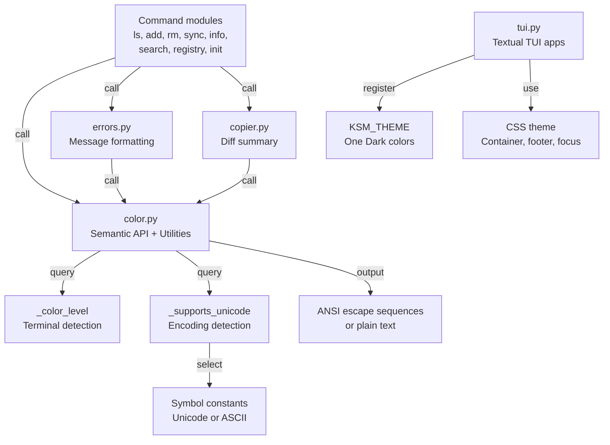

# Design Document: UX Visual Overhaul

## Overview

This design overhauls the `ksm` CLI visual layer to produce modern, scannable output inspired by tools like `gh`, `cargo`, and `pnpm`. The changes span the presentation layer across all command modules, the Textual TUI apps, and the shared formatting utilities — no business logic changes.

The overhaul covers:

1. **Semantic color palette** in `color.py` — intent-based functions (`success`, `accent`, `muted`, etc.) replacing raw ANSI wrappers, with composable `style()`, terminal capability detection (`_color_level()`), Unicode symbol system, ANSI stripping, and column alignment
2. **Error/warning formatting** in `errors.py` — lowercase prefixes, semantic colors, structured message hierarchy
3. **Command output formatting** across all command modules — column-aligned output, semantic color usage, relative paths, consistent typography
4. **Diff summary formatting** in `copier.py` — semantic colors, relative paths, symbol system
5. **Textual TUI theming** in `tui.py` — custom `KSM_THEME`, container wrapping, footer bar, CSS overhaul for all three apps

All changes are additive — existing `green`, `red`, `yellow`, `dim`, `bold` functions remain as backward-compatible aliases.

## Architecture



All visual decisions flow through `color.py`. The `_color_level()` function is the single point of truth for terminal capabilities. The `_wrap()` function uses it to decide whether to emit ANSI codes and whether to downgrade bright variants.

No new modules are introduced. Everything fits in existing files:
- `color.py` — semantic colors, `style()`, `_color_level()`, `_supports_unicode()`, `_strip_ansi()`, `_align_columns()`, symbol constants
- `errors.py` — updated `format_error`, `format_warning`, `format_deprecation`
- `copier.py` — updated `format_diff_summary` with semantic colors and relative paths
- `tui.py` — `KSM_THEME`, updated CSS, `Container` wrapping, footer bar, Rich Text options
- Command modules — updated output formatting using semantic API

### Decision: Why not a separate `formatting.py`?

`_align_columns()` and `_strip_ansi()` are tightly coupled to ANSI-aware text formatting. Keeping them in `color.py` avoids circular imports and keeps the API surface in one place. If `color.py` grows beyond ~300 lines, extraction can be revisited.

### Decision: Why 16-color ANSI, not 256-color?

Bright variants (90-97) are part of the base 16-color set and adapt to the user's terminal theme. They look intentional in both Dracula and Solarized. 256-color codes are fixed RGB values that can clash with terminal themes and break in SSH/CI environments.

### Decision: Why lowercase error/warning prefixes?

Modern CLIs (cargo, rustc, gh, pnpm) use lowercase. `error: bundle not found` reads as conversational. `Error: Bundle not found` reads as a system dialog from 2005.

### Decision: Why One Dark for TUI theme?

One Dark is the most popular dark theme family across VS Code and terminal emulators. Kiro IDE users are likely familiar with this aesthetic. The specific values (`#56b6c2` cyan, `#98c379` green, `#e06c75` red) have proven readability at terminal font sizes.

## Components and Interfaces

### color.py — Terminal Detection

```python
def _color_level(stream: TextIO | None = None) -> int:
    """Determine color support level.

    Priority order:
    1. NO_COLOR set → 0
    2. TERM=dumb → 0
    3. Non-TTY stream → 0
    4. COLORTERM=truecolor|24bit → 4
    5. TERM contains '256color' → 3
    6. Default TTY → 2
    """

def _supports_unicode() -> bool:
    """Check if terminal likely supports Unicode.

    Returns False when TERM=dumb or preferred encoding
    is not UTF-8. Uses locale.getpreferredencoding().
    """
```

### color.py — Semantic Color Functions

All follow the signature: `(text: str, stream: TextIO | None = None) -> str`.

```python
def success(text, stream=None) -> str:
    """Bright green (92) — success states, checkmarks."""

def error_style(text, stream=None) -> str:
    """Bright red (91) — error prefixes, failures."""

def warning_style(text, stream=None) -> str:
    """Bright yellow (93) — warning/deprecation prefixes."""

def accent(text, stream=None) -> str:
    """Bright cyan (96) — bundle names, highlights."""

def info(text, stream=None) -> str:
    """Bright blue (94) — informational labels, scope badges."""

def muted(text, stream=None) -> str:
    """Dim (2) — secondary information. Alias for dim()."""

def subtle(text, stream=None) -> str:
    """Dim italic (2;3) — hints, suggestions."""
```

### color.py — Composable Style Function

```python
def style(text: str, *codes: str, stream: TextIO | None = None) -> str:
    """Apply multiple ANSI codes as a single escape sequence.

    Example: style("hello", "1", "96") → bold bright cyan
    Joins codes with ';' into one \033[...m sequence.
    Returns plain text when color level is 0.
    """
```

### color.py — Text Utilities

```python
def _strip_ansi(text: str) -> str:
    """Remove ANSI escape sequences for width calculation.

    Uses regex: r'\\033\\[[0-9;]*m'
    """

def _align_columns(
    rows: list[tuple[str, ...]],
    gap: int = 2,
) -> list[str]:
    """Align columns with consistent padding.

    - Uses _strip_ansi() for accurate width calculation
    - Pads all columns except the last
    - Returns empty list for empty input
    """
```

### color.py — Symbol Constants

Resolved at module load based on `_supports_unicode()`:

| Constant | Unicode | ASCII Fallback | Usage |
|----------|---------|----------------|-------|
| `SYM_CHECK` | ✓ | * | Success/complete |
| `SYM_CROSS` | ✗ | x | Failure |
| `SYM_ARROW` | → | -> | Direction/target |
| `SYM_DOT` | · | - | Inline separator |
| `SYM_NEW` | + | + | New file (fixed) |
| `SYM_UPDATED` | ~ | ~ | Updated file (fixed) |
| `SYM_UNCHANGED` | = | = | Unchanged file (fixed) |

### color.py — _wrap() Enhancement

```python
def _wrap(text: str, code: str, stream: TextIO | None = None) -> str:
    """Wrap text with ANSI escape code if color is enabled.

    Uses _color_level() instead of _color_enabled().
    On 8-color terminals (level 1), downgrades bright codes
    (90-97) to standard codes (30-37) by subtracting 60.
    For compound codes like '2;3', downgrades the last
    component if it's in the bright range.
    """
```

### color.py — Backward Compatibility

Existing functions `green`, `red`, `yellow`, `dim`, `bold` remain unchanged in signature and behavior. They continue to use their current ANSI codes (32, 31, 33, 2, 1). The `_color_enabled()` function is retained internally but `_wrap()` migrates to use `_color_level()`.

### errors.py — Updated Formatting

```python
def format_error(
    what: str,
    why: str,
    fix: str,
    stream: TextIO | None = None,
) -> str:
    """Format error with lowercase 'error:' prefix.

    error: {what}
      {why}       ← muted style
      {fix}       ← subtle style

    Bundle names in {what} are styled with accent.
    """

def format_warning(
    what: str,
    detail: str,
    stream: TextIO | None = None,
) -> str:
    """Format warning with lowercase 'warning:' prefix.

    warning: {what}
      {detail}    ← muted style
    """

def format_deprecation(
    old: str,
    new: str,
    since: str,
    removal: str,
    stream: TextIO | None = None,
) -> str:
    """Format deprecation with lowercase 'deprecated:' prefix.

    deprecated: `{old}` is deprecated, use `{new}` instead
      Deprecated in {since}, will be removed in {removal}.  ← subtle
    """
```

### copier.py — Updated Diff Summary

```python
def format_diff_summary(
    results: list[CopyResult],
    base_path: Path | None = None,
    stream: TextIO | None = None,
) -> str:
    """Format CopyResult list as file-level diff summary.

    Uses semantic colors and symbol constants:
      + steering/code-review.md (new)      ← success + muted
      ~ skills/refactor/SKILL.md (updated) ← warning_style + muted
      = hooks/pre-commit.json (unchanged)  ← muted + muted

    When base_path is provided, displays paths relative to it.
    """
```

### tui.py — KSM_THEME

```python
from textual.theme import Theme

KSM_THEME = Theme(
    name="ksm",
    primary="#56b6c2",      # Cyan accent
    secondary="#61afef",    # Blue info
    accent="#56b6c2",       # Cyan
    success="#98c379",      # Soft green
    warning="#e5c07b",      # Soft yellow
    error="#e06c75",        # Soft red
    surface="#282c34",      # Dark background
    panel="#21252b",        # Darker panels
)
```

Registered in each app's `__init__`:

```python
def __init__(self, ...):
    super().__init__()
    self.register_theme(KSM_THEME)
    self.theme = "ksm"
```

### tui.py — CSS Theme (BundleSelectorApp & RemovalSelectorApp)

```css
Screen { background: $surface; layout: vertical; }

#container {
    border: round $accent;
    border-title-color: $accent;
    border-title-style: bold;
    padding: 0 1;
    margin: 1 2;
    height: 1fr;
}

Input {
    dock: top;
    margin: 0 0 1 0;
    border: tall $accent 30%;
    background: $surface-darken-1;
}
Input:focus { border: tall $accent; }
Input.-invalid { border: tall $error; }

OptionList {
    height: 1fr;
    background: transparent;
    border: none;
    scrollbar-color: $accent 30%;
    scrollbar-color-hover: $accent 60%;
    scrollbar-color-active: $accent;
}
OptionList > .option-list--option-highlighted {
    background: $accent 15%;
    text-style: bold;
}
OptionList > .option-list--option-hover {
    background: $accent 8%;
}
OptionList:focus > .option-list--option-highlighted {
    background: $accent 25%;
}

#selected-count {
    dock: bottom;
    text-style: bold;
    color: $accent;
    text-align: right;
}

#footer-bar {
    dock: bottom;
    height: 1;
    background: $accent 15%;
    color: $text-muted;
    padding: 0 1;
}
```

### tui.py — CSS Theme (ScopeSelectorApp)

```css
Screen { background: $surface; align: center middle; }

#scope-container {
    border: round $accent;
    border-title-color: $accent;
    border-title-style: bold;
    padding: 1 2;
    width: 40;
    height: auto;
    max-height: 12;
}

OptionList {
    height: auto;
    max-height: 4;
    background: transparent;
    border: none;
}
OptionList > .option-list--option-highlighted {
    background: $accent 20%;
    text-style: bold;
}
OptionList:focus > .option-list--option-highlighted {
    background: $accent 30%;
}
```

### tui.py — Structural Changes

BundleSelectorApp and RemovalSelectorApp wrap content in `Container(id="container")` with `border_title = "ksm"`. Footer bar replaces the instruction Static:

```python
def compose(self) -> ComposeResult:
    with Container(id="container"):
        yield Static("Select a bundle to install",
                      classes="selector-header")
        yield Input(placeholder="Type to filter...")
        yield OptionList()
        yield Static("", id="selected-count")
    yield Static(
        " [bold $accent]↑↓[/] Navigate  "
        "[bold $accent]Space[/] Toggle  "
        "[bold $accent]Enter[/] Confirm  "
        "[bold $accent]Esc[/] Cancel",
        id="footer-bar",
    )
```

ScopeSelectorApp wraps content in `Container(id="scope-container")` with `border_title = "ksm"`, centered layout, fixed width 40, max-height 12.

### tui.py — Rich Text OptionList Items

```python
from rich.text import Text

label = Text()
label.append(display_name, style="bold cyan")
if badge:
    label.append(badge, style="dim")
ol.add_option(Option(label, id=str(i)))
```

### Command Output Formatting Changes

Each command module is updated to use semantic colors and the shared utilities. The pattern is consistent:

#### ls.py

```
Local bundles:                          ← bold header
  my-bundle       default       2d ago  ← accent name, muted registry (no parens), muted time
  other-bundle    my-registry   5m ago  ← column-aligned via _align_columns()

Global bundles:                         ← bold header, one blank line separator
  shared-config   default       1w ago
```

Verbose (`-v`) adds 4-space-indented muted file paths below each bundle. Empty state prints helpful message to stderr.

#### add.py

```
✓ Installed my-bundle → .kiro/ (local)  ← SYM_CHECK+success, accent name, muted scope
  + steering/code-review.md (new)       ← success +, muted (new)
  ~ skills/refactor/SKILL.md (updated)  ← warning_style ~, muted (updated)
  = hooks/pre-commit.json (unchanged)   ← muted =, muted (unchanged)
```

File paths relative to `.kiro/`, not absolute.

#### rm.py

Confirmation:
```
Remove my-bundle from local scope?      ← accent name, info scope
  4 files in .kiro/:                    ← muted count
    steering/code-review.md             ← muted files
    ...
Continue? [y/n]                         ← bold [y/n]
```

Result:
```
✓ Removed my-bundle — 4 files deleted (local)  ← success check, accent name, muted summary
```

With missing files: `3 files deleted, 1 already missing`.

#### sync.py

Confirmation:
```
Sync 3 bundles?                         ← bold count
  my-bundle       local  · 4 files      ← accent name, muted scope+count, SYM_DOT separator
  other-bundle    local  · 1 file
  shared-config   global · 3 files

This will overwrite configuration files. Continue? [y/n]  ← bold [y/n]
```

Per-bundle result uses same format as add.

#### info.py

```
my-bundle                               ← accent name
  Registry   default                    ← no colons, muted value
  Contents   steering/ 2 items · skills/ 1 item  ← flattened, SYM_DOT separator
  Installed  local                      ← success when installed, muted when not
```

No internal file path displayed.

#### search.py

```
my-bundle         default    steering, skills   ← accent name, muted registry+types, aligned
other-bundle      custom     hooks
```

Empty state: `No bundles matching foo` with accent query and subtle suggestion.

#### registry_ls.py

```
default          (local)          3 bundles      ← accent name, muted URL, muted count, aligned
my-registry      github.com/...   5 bundles
```

Single line per registry. No internal cache path.

#### registry_inspect.py

```
my-registry  https://github.com/...             ← bold name, muted URL

  my-bundle                                      ← accent name
    steering/  code-review.md, testing.md        ← muted subdir, inline comma-separated items
    skills/    refactor/
  other-bundle
    hooks/     pre-commit.json
```

No Default/Path/Bundles count metadata.

#### init.py

```
✓ Initialised .kiro/ in current directory        ← success check, info .kiro/
Run 'ksm add' to install your first bundle.      ← subtle hint
```

Already exists: `Already initialised — .kiro/ exists.` in muted.

### Typography and Spacing Rules

Applied consistently across all commands:
- One blank line between scope groups
- 2-space indent for first-level, 4-space for nested (file lists)
- No trailing blank lines
- `SYM_DOT` (· or -) as inline metadata separator
- Bold section headers

## Data Models

No new data models or classes. Changes are purely functional.

### Type Definitions

| Parameter | Type | Description |
|-----------|------|-------------|
| `text` | `str` | Text to wrap with ANSI codes |
| `stream` | `TextIO \| None` | Output stream for TTY detection; defaults to `sys.stdout` |
| `codes` | `*str` | Variable ANSI code strings for `style()` |
| `rows` | `list[tuple[str, ...]]` | Row tuples for `_align_columns()` |
| `gap` | `int` | Column gap in spaces (default 2) |
| `base_path` | `Path \| None` | Base path for relative path display in diff summary |

### Color Level Mapping

| Level | Meaning | Detection | Behavior |
|-------|---------|-----------|----------|
| 0 | No color | `NO_COLOR` set, `TERM=dumb`, non-TTY | Plain text |
| 1 | 8-color | TTY, no higher indicators | Downgrade 90-97 → 30-37 |
| 2 | 16-color | Default TTY | Bright variants as-is |
| 3 | 256-color | `TERM` contains `256color` | Bright variants (no 256-color codes used) |
| 4 | True color | `COLORTERM=truecolor\|24bit` | Bright variants (no true-color codes used) |


## Correctness Properties

*A property is a characteristic or behavior that should hold true across all valid executions of a system — essentially, a formal statement about what the system should do. Properties serve as the bridge between human-readable specifications and machine-verifiable correctness guarantees.*

### Property 1: Color functions produce correct ANSI codes

*For any* input string and any semantic color function (success, error_style, warning_style, accent, info, muted, subtle) or legacy function (green, red, yellow, dim, bold), when called with a TTY stream at color level ≥ 2, the output shall contain the expected ANSI escape code for that function and the original text.

**Validates: Requirements 1.1, 1.3**

### Property 2: style() combines multiple ANSI codes

*For any* input string and any set of valid ANSI code strings, `style(text, *codes)` on a TTY stream at color level ≥ 2 shall produce a string containing a single escape sequence with all codes joined by semicolons, wrapping the original text.

**Validates: Requirements 1.2**

### Property 3: Bright variant downgrade on 8-color terminals

*For any* bright ANSI code in range 90-97 and any input string, when `_wrap()` is called with a stream at color level 1, the output shall contain the corresponding standard code (code - 60) instead of the bright code.

**Validates: Requirements 1.4**

### Property 4: strip_ansi round trip

*For any* plain string (containing no ANSI escape sequences), wrapping it with any color function and then calling `_strip_ansi()` shall return the original string.

**Validates: Requirements 1.5**

### Property 5: _color_level() returns valid level respecting environment priority

*For any* combination of environment variables (NO_COLOR, TERM, COLORTERM) and stream TTY state, `_color_level()` shall return a value in {0, 1, 2, 3, 4} following the priority: NO_COLOR set → 0, TERM=dumb → 0, non-TTY → 0, COLORTERM=truecolor|24bit → 4, TERM contains 256color → 3, default TTY → 2.

**Validates: Requirements 2.1, 2.2, 2.3, 2.4, 2.5, 2.6, 2.7**

### Property 6: _align_columns() produces ANSI-aware aligned output with no last-column padding

*For any* non-empty list of row tuples (potentially containing ANSI escape sequences), `_align_columns()` shall produce lines where the visible (ANSI-stripped) start position of each column is consistent across all rows, and the last column in each row has no trailing padding spaces.

**Validates: Requirements 4.2, 4.3**

### Property 7: Error/warning/deprecation formatting uses correct prefixes and semantic styles

*For any* message strings (what, why, fix, old, new, since, removal), `format_error` shall produce output starting with lowercase `error:` in error_style with the why line in muted and fix line in subtle; `format_warning` shall start with lowercase `warning:` in warning_style; `format_deprecation` shall start with lowercase `deprecated:` in warning_style.

**Validates: Requirements 5.1, 5.2, 5.3, 5.4, 5.5**

### Property 8: Error messages style bundle names with accent

*For any* error message containing a bundle name, the formatted output shall wrap the bundle name with the accent ANSI code.

**Validates: Requirements 5.6**

### Property 9: Diff summary uses semantic colors per status

*For any* list of CopyResult entries, `format_diff_summary()` shall style NEW entries with success-colored SYM_NEW and muted "(new)", UPDATED entries with warning_style-colored SYM_UPDATED and muted "(updated)", and UNCHANGED entries with muted-colored SYM_UNCHANGED and muted "(unchanged)".

**Validates: Requirements 7.2, 7.3, 7.4, 9.4, 15.2, 15.3, 15.4**

### Property 10: Diff summary displays relative paths

*For any* list of CopyResult entries and a base_path, `format_diff_summary()` shall display file paths relative to the base_path, not as absolute paths.

**Validates: Requirements 7.5, 15.1**

### Property 11: ls output uses semantic colors and column alignment

*For any* non-empty list of manifest entries, `_format_grouped()` shall produce output where bundle names are wrapped in accent ANSI codes, registry names are wrapped in muted codes without parentheses, timestamps are wrapped in muted codes, and columns are aligned via `_align_columns()`.

**Validates: Requirements 6.1, 6.2, 6.3, 6.4**

### Property 12: ls output groups by scope with bold headers

*For any* list of manifest entries spanning multiple scopes, `_format_grouped()` shall produce output with bold section headers ("Local bundles:", "Global bundles:") separated by exactly one blank line, with local appearing before global.

**Validates: Requirements 6.5, 16.1**

### Property 13: ls verbose mode shows indented muted file paths

*For any* manifest entry with installed files, when verbose is True, `_format_grouped()` shall include each file path indented 4 spaces and wrapped in muted ANSI codes below its bundle line.

**Validates: Requirements 6.6**

### Property 14: add success output format

*For any* bundle name and scope, the add command success output shall contain SYM_CHECK styled with success, the bundle name styled with accent, SYM_ARROW, and the scope path styled with muted.

**Validates: Requirements 7.1**

### Property 15: rm confirmation uses correct semantic styles

*For any* manifest entry, the rm confirmation prompt shall contain the bundle name styled with accent, the scope styled with info, file count and file list styled with muted, and "Continue? [y/n]" with bold [y/n].

**Validates: Requirements 8.1, 8.2**

### Property 16: rm result format with missing file handling

*For any* bundle name, scope, and RemovalResult, the rm result shall contain SYM_CHECK styled with success, the bundle name styled with accent, and a muted summary. When skipped_files is non-empty, the summary shall include the count of already-missing files.

**Validates: Requirements 8.3, 8.4**

### Property 17: sync confirmation lists bundles with semantic styles

*For any* list of manifest entries to sync, the sync confirmation shall show a bold total count header, each bundle name styled with accent, scope and file count styled with muted with SYM_DOT separator, and "Continue? [y/n]" with bold [y/n].

**Validates: Requirements 9.1, 9.2**

### Property 18: sync per-bundle result format

*For any* synced bundle name, the sync result shall contain SYM_CHECK styled with success and the bundle name styled with accent.

**Validates: Requirements 9.3**

### Property 19: info output format

*For any* resolved bundle, the info output shall display the bundle name styled with accent, metadata labels without colons with muted values, contents flattened to a single line with SYM_DOT separators, no internal file path, and installed scope styled with success (when installed) or muted (when not).

**Validates: Requirements 10.1, 10.2, 10.3, 10.4, 10.5**

### Property 20: search output uses semantic colors and alignment

*For any* non-empty search results, the output shall display bundle names styled with accent, registry names and content types styled with muted, and columns aligned via `_align_columns()`.

**Validates: Requirements 11.1, 11.2, 11.3**

### Property 21: registry ls single-line format with alignment

*For any* list of registries, the output shall display each registry on a single line with accent-styled name, muted URL (or "(local)"), muted bundle count, columns aligned via `_align_columns()`, and no internal cache path.

**Validates: Requirements 12.1, 12.2, 12.3**

### Property 22: registry inspect inline format

*For any* registry with bundles, the output shall display bold registry name with muted URL on the header, accent-styled bundle names, subdirectory contents inline as comma-separated items with muted subdirectory names, and no internal metadata (Default, Path, Bundles count).

**Validates: Requirements 13.1, 13.2, 13.3, 13.4**

### Property 23: CLI output has no trailing blank lines

*For any* command output string produced by ls, add, rm, sync, info, search, registry ls, or registry inspect, the string shall not end with a trailing blank line.

**Validates: Requirements 16.3**

## Error Handling

### Color System Errors

- `_color_level()` never raises — returns 0 on any detection failure
- `_supports_unicode()` never raises — returns False on any detection failure
- `_strip_ansi()` handles empty strings and strings with no ANSI codes
- `_align_columns()` handles empty input (returns `[]`), single-row input, and rows with varying tuple lengths (pads shorter rows)
- `_wrap()` handles compound codes (e.g., "2;3") for bright downgrade by parsing the last component

### Error Formatting

- `format_error`, `format_warning`, `format_deprecation` never raise — they produce plain text when color is disabled
- Bundle name accent styling in error messages uses simple string detection — if the bundle name appears in the `what` parameter, it gets wrapped

### TUI Theme

- `KSM_THEME` registration failure falls through to Textual's default theme — the apps remain functional
- Container wrapping is purely structural — if Container import fails, the apps degrade to the current flat layout

## Testing Strategy

### Dual Testing Approach

Both unit tests and property-based tests are required:

- **Unit tests**: Specific examples, edge cases, error conditions, TUI structural verification
- **Property tests**: Universal properties across generated inputs using Hypothesis

### Property-Based Testing Configuration

- Library: **Hypothesis** (already a project dependency)
- Profiles: `dev` (15 examples), `ci` (100 examples) per project standards
- Each property test references its design property with a tag comment:
  `# Feature: ux-visual-overhaul, Property N: <title>`
- Each correctness property is implemented by a single `@given` test

### Unit Test Focus

- Symbol constant values (Unicode vs ASCII) under different env configs
- `_color_level()` specific environment combinations (examples from Req 2.3-2.5, 2.7)
- `_supports_unicode()` with TERM=dumb
- `_align_columns()` empty input edge case
- TUI theme registration and CSS structure (Req 17.1, 17.2)
- TUI Container wrapping and footer bar presence (Req 18.1-18.3, 19.1-19.3)
- TUI OptionList/Input CSS properties (Req 20.1-20.6)
- TUI Rich Text formatting in OptionList items (Req 21.1-21.2)
- init command output format (Req 14.1-14.3)
- search empty state (Req 11.4)
- ls empty state (Req 6.7)

### Property Test Focus

Properties 1-23 as defined above, each implemented as a single Hypothesis test generating random inputs (strings, env configurations, manifest entries, CopyResults) and verifying the universal property holds.
